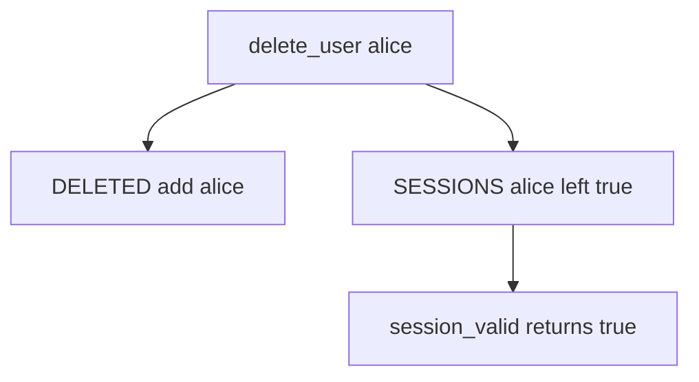

# 4.1-LO-03 — Observe the leftover session, do not trophy a cookie

**Kind:** mechanism-lab
**Loop step:** 3 Break
**Standards:** OWASP ASVS 5.0.0 (final) `v5.0.0-7.4.2`.

## Authorized scope

`labs/4.1/4.1-lab` only. Synthetic user `alice`. No live IdPs.

**Forbidden outcome:** Deleted user's leftover session still authenticates.

## Mental model: profile marked, cookie still live



The vulnerable tree demonstrates **cause** (artifact outlived the subject), not a trophy dump of a production cookie.

## What to read in the fixture

`vulnerable/lifecycle.py` `delete_user` only adds the user to `DELETED`. `session_valid` still returns `SESSIONS.get(user)`. Tests require `session_valid` false after delete, and true before delete for the honest path.

## Root cause vs impact

| Slice | Lab |
|---|---|
| Root cause | Authentication artifact outlived the subject |
| Impact | Ex-employee cookie still reads notes |
| Not the lesson | An SSO product name as the definition |

## Practice

```
python3 -m pytest labs/4.1/4.1-lab/tests --impl vulnerable
```

Record `test_deleted_user_session_is_dead`. Do not weaken it to “the profile row is gone.”

## Transfer

Clinic: badge off, EHR cookie still valid. Predict without leaving this directory.

## Non-goals

No live-target instructions. Synthetic data only.
