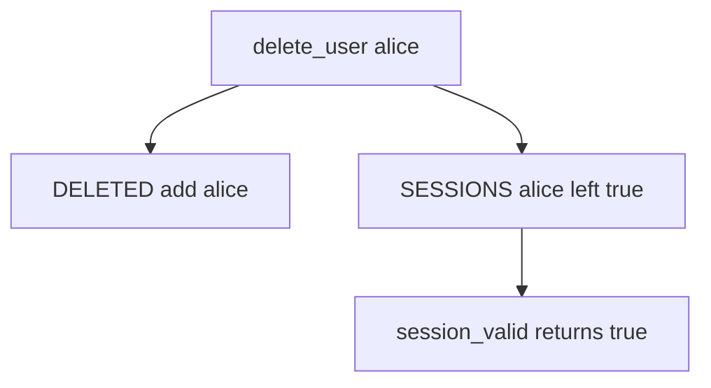

# 4.1-LO-03 — Observe the leftover session, do not trophy a cookie

**Kind:** mechanism-lab
**Loop step:** 3 Break
**Standards:** OWASP ASVS 5.0.0 (final) `v5.0.0-7.4.2`. NIST SP 800-63-4 (final) separates identifiers, authenticators, and session; this oracle is session-after-delete. Starlette SessionMiddleware is not this sentence.

## Authorized scope

`labs/4.1/4.1-lab` only. The fixture is an in-process `SESSIONS` map and `DELETED` set. Synthetic user `alice`. It does not open an IdP, Auth0, or a browser cookie jar. Do not replay a production cookie, an employer SSO session, or a classmate login.

**Forbidden outcome:** a deleted user’s leftover session still authenticates. After `delete_user("alice")`, `session_valid("alice")` is true.

Attacker capability in this lab: an ex-employee (or a copied cookie on a shared workstation) who can present `SESSIONS["alice"]` after offboarding. That stands in for a delayed worker (7.4) still holding `user_id`. Trust assumption: `delete_user` is supposed to kill artifacts in the same use-case. HR email, “password disabled,” and SSO brand names are not in the TCB for this cell.

## Mental model: profile marked, cookie still live



The vulnerable tree demonstrates **cause** (artifact outlived the subject), not a trophy dump of a production cookie. Preconditions: `delete_user` only adds the user to `DELETED`; `session_valid` still returns `SESSIONS.get(user)`. You do not need a real cookie string. You must not steal one.

ASVS `v5.0.0-7.4.2` wants all active sessions terminated when an account is disabled or deleted. `DELETE FROM users` is a profile observation, not that termination.

## What to read in the fixture

`vulnerable/lifecycle.py` `delete_user` only adds the user to `DELETED`. `session_valid` still returns `SESSIONS.get(user)`. Tests:

- `test_active_session_is_valid` — honest path before delete
- `test_deleted_user_session_is_dead` — `session_valid` false after delete
- `test_deleted_denies_even_if_session_map_still_has_row` — resurrected map entry still denied on the fixed tree

You do not need a new username. The failure of `test_deleted_user_session_is_dead` *is* the evidence.

Do not open the fixed tree yet. Diagnose the cause first.

## Root cause vs impact vs prevention vs detection vs recovery

| Slice | This lab |
|---|---|
| Required property | After delete, `session_valid("alice")` is false |
| Root cause | Authentication artifact outlived the subject |
| Preconditions | `delete_user` removes profile only |
| Trigger | Cookie presented after offboarding |
| Impact | Confidentiality of tenant notes; 1.2 over time |
| Prevention | Invalidate sessions (and tokens, workers) in the same use-case |
| Detection | Use of session after `user_state=deleted` |
| Recovery | Mass revoke; rotate signing keys if tokens self-verify |
| Not the lesson | An SSO product name, SessionMiddleware, or “we emailed them” |

## Framework defaults versus the lifecycle guarantee

SessionMiddleware does not know HR offboarding. A JWT with `exp` in 30 days still verifies unless you check a per-user not-before. The application guarantee is: **this** fixture, after `delete_user("alice")`, `session_valid("alice") is False`.

## Practice

```text
python3 -m pytest labs/4.1/4.1-lab/tests --impl vulnerable
```

Record `test_deleted_user_session_is_dead`. Do not weaken it to “the profile row is gone.” An environment error is not security evidence.

## Transfer

Clinic: badge off, EHR cookie still valid. Predict without leaving this directory. Do not hit a clinic IdP.

## Non-goals

No live-target token replay. Synthetic `alice` only.
