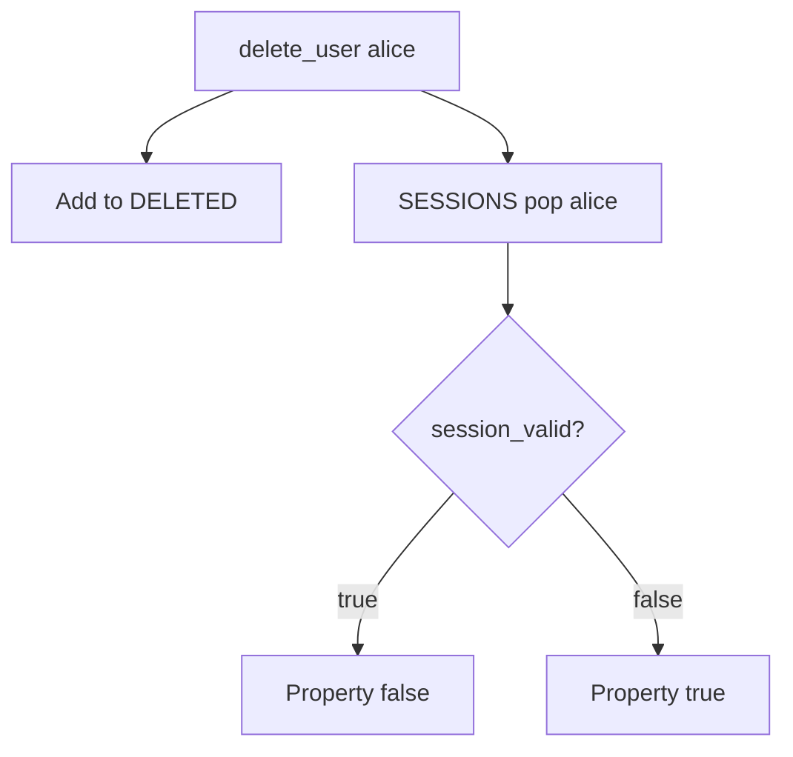

# 4.1-LO-04 — Invalidate the session in the same delete use-case

**Kind:** design-exercise
**Loop step:** 4 Build
**Standards:** OWASP ASVS 5.0.0 (final) `v5.0.0-7.4.1` and `v5.0.0-7.4.2`. `v5.0.0-6.5.6` is **Level 3, advanced** (revoke a factor on theft), not this pytest.

## Structural means the cookie cannot authenticate

`delete_user` must pop the session **and** `session_valid` must treat `DELETED` as deny. Structural means the delete use-case kills artifacts — not an email, not “disable password,” not SLO as a brand, not `DELETE FROM users` alone.

The smallest restore for SecureCollab Phase 1 offboarding is: add `alice` to `DELETED`, pop `SESSIONS["alice"]`, and refuse authentication if the user is in `DELETED` even if someone writes the map back. Fail-safe: if the session store is down, **deny** authentication for that user (do not fail open).

## Mental model: mark deleted and drop the session



The lab’s fixed tree pops the session and checks `DELETED` first. Production should also invalidate refresh tokens, worker `user_id` (7.4), and mobile offline cache (8.2). Self-contained JWTs need a denylist or per-user not-before (`v5.0.0-7.4.1`). Disabled and deleted are different product states; both must fail `session_valid` in this lab’s freeze.

ASVS `v5.0.0-7.4.2` (Level 2) wants all active sessions terminated. This pytest is that sentence for one synthetic cookie, not proofing (800-63-4) or WebAuthn (4.2).

## Why this restores the cell

| After the fix | Must be true |
|---|---|
| After delete | `session_valid("alice") is False` |
| Before delete | honest session still valid |
| Deleted set | even a resurrected `SESSIONS` entry is denied |

## What this is not

`DELETE FROM users` without session purge. JWT `exp` 30d. Worker `user_id` (7.4). Mobile cache (8.2). Auth0 SLO as a product name. SessionMiddleware defaults.

## Mechanism limits

- Email “you’re deleted” is not revocation.
- Refresh-token family (4.3 / 4.5).
- Shared device cookies you did not list.
- Backups still contain the user row (5.1).
- Recovery and re-enrollment (4.2) must not resurrect the old cookie.

## Practice

Name subject (ex-employee with leftover cookie), object (`alice` session), predicate (`session_valid` false after delete). Run:

```text
python3 -m pytest labs/4.1/4.1-lab/tests --impl fixed
```

Must pass.

## Transfer

Clinic: disable badge and kill EHR sessions in one runbook. A badge vendor API is not the EHR session store.

## Residual risk

Self-contained tokens until per-user not-before or key rotation; backups (5.1); worker identity (7.4); mobile cache (8.2).

## Usability

If you show “you are signed out,” announce it (WCAG 2.2 Success Criterion 4.1.3). The announcement is not revocation.
