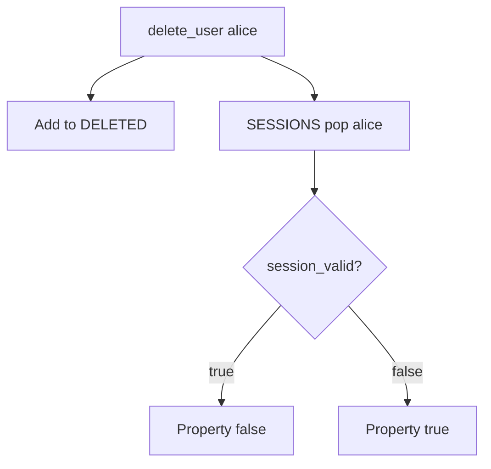

# 4.1-LO-04 — Invalidate the session in the same delete use-case

**Kind:** design-exercise
**Loop step:** 4 Build
**Standards:** OWASP ASVS 5.0.0 (final) `v5.0.0-7.4.1` and `v5.0.0-7.4.2`.

## Structural means the cookie cannot authenticate

`delete_user` must pop the session **and** `session_valid` must treat `DELETED` as deny. Structural means the delete use-case kills artifacts — not an email, not “disable password,” not SLO as a brand.

## Mental model: mark deleted and drop the session



Fail-safe: if session store is down, **deny** authentication for that user (do not fail open).

## Why this restores the cell

| After the fix | Must be true |
|---|---|
| After delete | `session_valid("alice") is False` |
| Before delete | honest session still valid |
| Deleted set | even a resurrected SESSIONS entry is denied |

## What this is not

`DELETE FROM users` without session purge. JWT `exp` 30d. Worker `user_id` (7.4). Mobile cache (8.2).

## Practice

Name subject, object, and predicate. Run:

```
python3 -m pytest labs/4.1/4.1-lab/tests --impl fixed
```

Must pass.

## Transfer

Clinic: disable badge and kill EHR sessions in one runbook.

## Residual risk

Self-contained tokens until per-user not-before or key rotation; backups (5.1).
