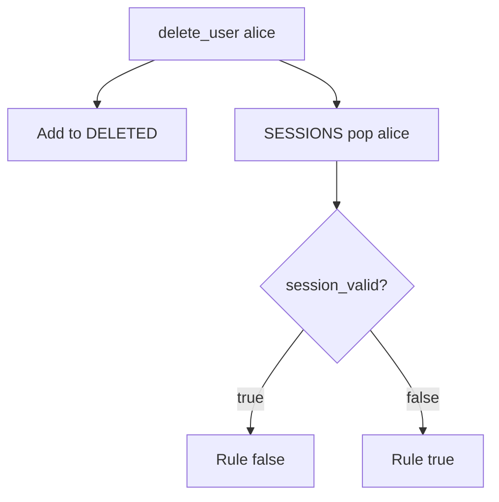

# Invalidate the session in the same delete

**Kind:** design-exercise
**Loop step:** 4 Build

## The rule

A later email is not the fix. “Disable the password” is not the fix. A logout product name is not the fix. `DELETE FROM users` alone is not the fix.

The structural change is: `delete_user` **pops the session**, and `session_valid` **treats `DELETED` as deny**. Kill leftovers in the same use-case. Same delete. Not a follow-up ticket.

The smallest restore for a notes-app offboard is: add `alice` to `DELETED`, pop `SESSIONS["alice"]`, and refuse authentication if the user is in `DELETED` even if someone writes the map back. Fail closed: if the session store is down, **deny** authentication for that user. Do not fail open.

## Picture: mark deleted and drop the session



The repaired files pop the session and check `DELETED` first. Production should also kill refresh tokens, worker `user_id`, and a phone's offline cache. Self-contained tokens need a denylist or a per-user not-before. Disabled and deleted are different product states. Both must fail `session_valid` in this week's freeze.

Industry lists want all active sessions killed. This pytest is that sentence for one synthetic cookie, not proofing who someone is, and not a new login factor.

## What the repaired files must show

Read `fixed/lifecycle.py` against this checklist. Do not treat the snippet as a production session store.

| After the fix | Must be true |
|---|---|
| After delete | `session_valid("alice") is False` |
| Before delete | honest session still valid |
| Deleted set | even a resurrected `SESSIONS` entry is denied |

Fail closed: if you cannot ask the session store, the answer is no. Uncertainty is a **deny**, not a yes because the dashboard still showed “signed in.”

## What this is not

- `DELETE FROM users` without session purge.
- A token with `exp` in 30 days.
- Worker `user_id` (later).
- A phone's offline cache (later).
- Single-sign-on logout as a product name.
- SessionMiddleware defaults.

## What the tool cannot do

- Email “you’re deleted” is not killing the session.
- A refresh-token family (later).
- Shared-device cookies you did not list.
- Backups still contain the user row (later).
- Recovery and signing up again must not bring the old cookie back to life.

## Can people still use it

If you show “you are signed out,” say it in text a screen reader can speak. Do not encode signed-out as color only. The announcement is not the kill.

## Practice

Name who (ex-employee with leftover cookie), what (`alice` session), and the check that must be true after the fix (`session_valid` false after delete). Run:

```text
python3 -m pytest labs/4.1/4.1-lab/tests --impl fixed
```

It must pass. Then write one sentence: which rule is restored, and which leftover you refused to delete.

## Use it somewhere new

Clinic: disable the badge and kill chart sessions in one runbook. A badge vendor API is not the chart session store.

## What can still go wrong

Self-contained tokens until a per-user not-before or key rotation. Backups. Worker identity. A phone's offline cache.
