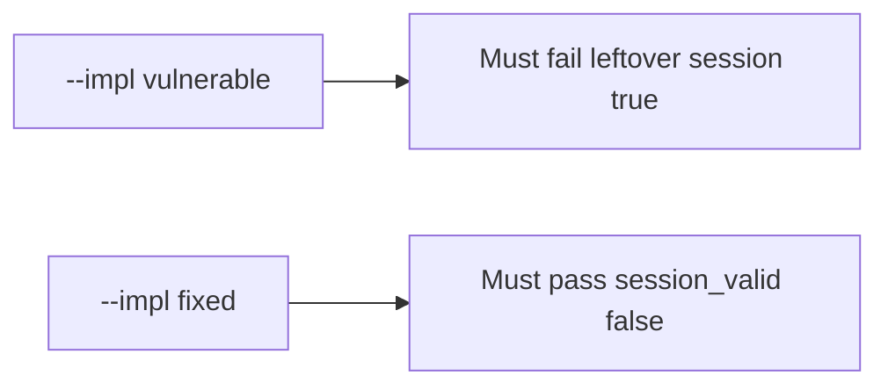

# 4.1-LO-05 — Evidence is session_valid false after delete, then a passing pair

**Kind:** verification-lab
**Loop step:** 5 Verify
**Standards:** OWASP ASVS 5.0.0 (final) `v5.0.0-7.4.2`.

## An invariant that cannot fail a test is still a slogan

“We deleted the row” is not evidence. The oracle is the local pair.

## Mental model: fail-on-vulnerable, pass-on-fixed



| Case | Must show |
|---|---|
| Negative / abuse | `session_valid` after `delete_user` is false |
| Normal | session still valid before delete |
| Not claimed | IdP SLO; refresh tokens; mobile cache |

Lab tests in `labs/4.1/4.1-lab/tests/test_property.py`:

```
python3 -m pytest labs/4.1/4.1-lab/tests --impl vulnerable
python3 -m pytest labs/4.1/4.1-lab/tests --impl fixed
```

## What the tests do not prove

- Refresh-token family (4.3 / 4.5)
- Worker identity (7.4)
- Backup residual (5.1)

## Practice

Execute both implementations. Map each test to an LO-02 cell.

## Transfer

Clinic clinician. A test that only asserts HTTP 200 is not lifecycle evidence (see 9.3).
