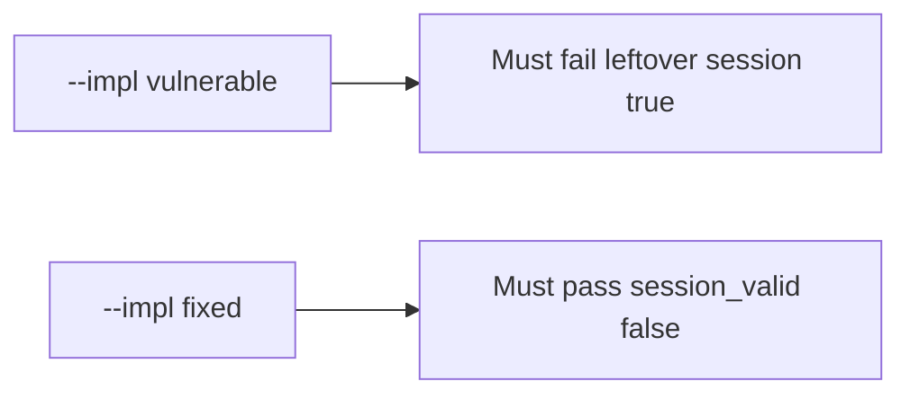

# 4.1-LO-05 — Evidence is session_valid false after delete, then a passing pair

**Kind:** verification-lab
**Loop step:** 5 Verify
**Standards:** OWASP ASVS 5.0.0 (final) `v5.0.0-7.4.2`. SessionMiddleware is not this pair.

## An invariant that cannot fail a test is still a slogan

“We deleted the row” is not evidence. “SSO is on” is a mechanism observation. The oracle is: after `delete_user("alice")`, `session_valid("alice") is False`. That observation must be **false** on `--impl vulnerable` (the helper returns true) and **true** on `--impl fixed`.

## Mental model: vulnerable must fail: leftover session true

The failing observation on `--impl vulnerable` is **leftover session true**. A passing collection count is not this cell.



| Mode | Must show for this module |
|---|---|
| Normal | Session still valid before delete (`test_active_session_is_valid`) |
| Negative / abuse | `session_valid` after `delete_user` is false; vulnerable must fail |
| Failure | Resurrected map entry still denied (`test_deleted_denies_even_if_session_map_still_has_row`) |
| Not claimed | IdP SLO; refresh tokens; mobile cache; JWT denylist complete |

Lab tests in `labs/4.1/4.1-lab/tests/test_property.py`. `test_deleted_user_session_is_dead` is a **forbidden-outcome** test: a leftover session that still authenticates is not allowed to count as a passing control.

```text
python3 -m pytest labs/4.1/4.1-lab/tests --impl vulnerable
python3 -m pytest labs/4.1/4.1-lab/tests --impl fixed
```

Map each test to an LO-02 cell. If vulnerable does not fail the leftover-session assertion, the lab is miswired—fix the wiring, not the assertion.

## What the tests do not prove

- Refresh-token family (4.3 / 4.5)
- Worker identity (7.4)
- Backup residual (5.1)
- Mobile offline cache (8.2)
- Factor revocation (`v5.0.0-6.5.6` Level 3 advanced)

Record those as residuals or later modules, not as silent passes.

## Practice

Execute both implementations this session. Write the fail/pass pair next to the matrix row. Reject a “test” that only greps `DELETED.add` without calling `session_valid` after `delete_user`.

## Transfer

Clinic clinician. A test that only asserts HTTP 200 is not lifecycle evidence (see 9.3). A test that logs into a live EHR is out of scope.

## Non-goals

Do not add a live IdP. Do not paste production cookies. Keys stay out of this file.
