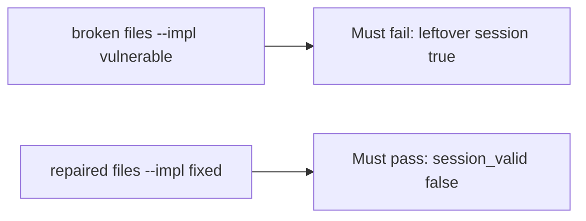

# A leftover session must fail the check

**Kind:** verification-lab
**Loop step:** 5 Verify

## Check it

Deleting the profile row does not kill the session. A single-sign-on toggle is a product. After `delete_user("alice")`, `session_valid("alice")` has to be False. On the broken files the helper still returns true. On the repaired files it does not.

## Picture: a leftover session must fail the check

Asserting the profile is gone can still hide that the cookie still works.



If both pass, you are not looking at `session_valid` after delete.

## What the check has to show

| Mode | Must show for this topic |
|---|---|
| Normal | Session still valid before delete (`test_active_session_is_valid`) |
| Wrong input / abuse | `session_valid` after `delete_user` is false; broken files must fail |
| Failure | Resurrected map entry still denied (`test_deleted_denies_even_if_session_map_still_has_row`) |
| Not claimed | Identity-provider logout; refresh tokens; phone cache; token denylist complete |

The test `test_deleted_user_session_is_dead` calls `delete_user` then `session_valid`. That check is there so a leftover session that still works still fails.

A `DELETED.add` line is not `session_valid` after `delete_user`. This practice never opens a live identity provider.

```text
python3 -m pytest labs/4.1/4.1-lab/tests --impl vulnerable
python3 -m pytest labs/4.1/4.1-lab/tests --impl fixed
```

Map the test to the deleted-alice × leftover-session row you wrote. If the broken files do not fail the leftover-session assertion, the lab is miswired — fix the wiring, not the assertion. A setup error is not proof the rule holds.

## What the tests do not prove

- Refresh-token family (later)
- Worker identity (later)
- Backup leftover (later)
- A phone's offline cache (later)
- Revoking a stolen login factor (advanced; not this check)

## Use it somewhere new

Clinic clinician. Asserting HTTP 200 is not lifecycle evidence. Do not run a test that logs into a live chart system.

## What this page is not doing

Do not add a live identity provider. Do not paste production cookies. Answer keys are not on this site.
