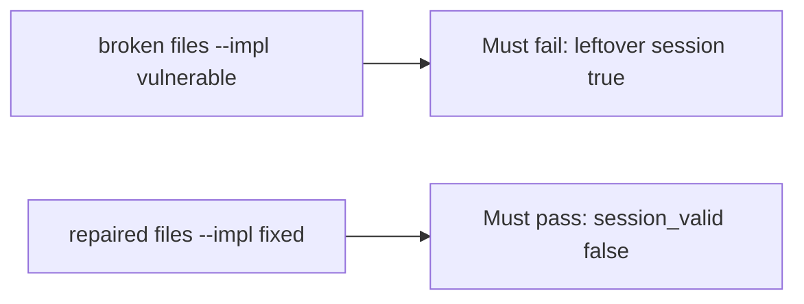

# A leftover session must fail the check

**Kind:** verification-lab
**Loop step:** 5 Verify

## If you cannot test it, it is still a slogan

“We deleted the row” is not evidence. “Single sign-on is on” is a tool observation. The check is: after `delete_user("alice")`, `session_valid("alice")` is False. That observation must be **false** on the broken files (the helper still returns true) and **true** on the repaired files.

## Picture: a leftover session must fail the check

A test that only asserts the profile is gone can pass while the cookie still works. This check asks whether a leftover session after delete still counts as a passing control. Broken must fail that question. Repaired must pass it.



If both pass, the test is not looking at `session_valid` after delete. If both fail, the fix is not structural or the check is wrong.

## Four modes, even for one cookie

| Mode | Must show for this topic |
|---|---|
| Normal | Session still valid before delete (`test_active_session_is_valid`) |
| Wrong input / abuse | `session_valid` after `delete_user` is false; broken files must fail |
| Failure | Resurrected map entry still denied (`test_deleted_denies_even_if_session_map_still_has_row`) |
| Not claimed | Identity-provider logout; refresh tokens; phone cache; token denylist complete |

The file is `labs/4.1/4.1-lab/tests/test_property.py`. The test `test_deleted_user_session_is_dead` calls `delete_user` then `session_valid`. That is a **what-must-not-happen** test: a leftover session that still works is not allowed to count as a passing control.

A test that only asserts HTTP 200 is not this topic's evidence. A test that only greps `DELETED.add` without calling `session_valid` after `delete_user` is not this topic's evidence. This practice never opens a live identity provider.

```text
python3 -m pytest labs/4.1/4.1-lab/tests --impl vulnerable
python3 -m pytest labs/4.1/4.1-lab/tests --impl fixed
```

Map the test to the deleted-alice × leftover-session row you wrote. If the broken files do not fail the leftover-session assertion, the lab is miswired — fix the wiring, not the assertion. A setup error is not proof the rule holds.

## What the tests do not prove

- Refresh-token family (later)
- Worker identity (later)
- Backup leftover (later)
- A phone's offline cache (later)
- Revoking a stolen login factor (advanced; not this check)

Record those as leftover or later topics, not as silent passes.

## Practice

Run both this session:

```text
python3 -m pytest labs/4.1/4.1-lab/tests --impl vulnerable
python3 -m pytest labs/4.1/4.1-lab/tests --impl fixed
```

Paste nothing from answer keys. Write fail/pass into your notes next to the matrix row.

## Use it somewhere new

Clinic clinician. A test that only asserts HTTP 200 is not lifecycle evidence. A test that logs into a live chart system is out of scope.

## What this page is not doing

Do not add a live identity provider. Do not paste production cookies. Answer keys are not on this site.
