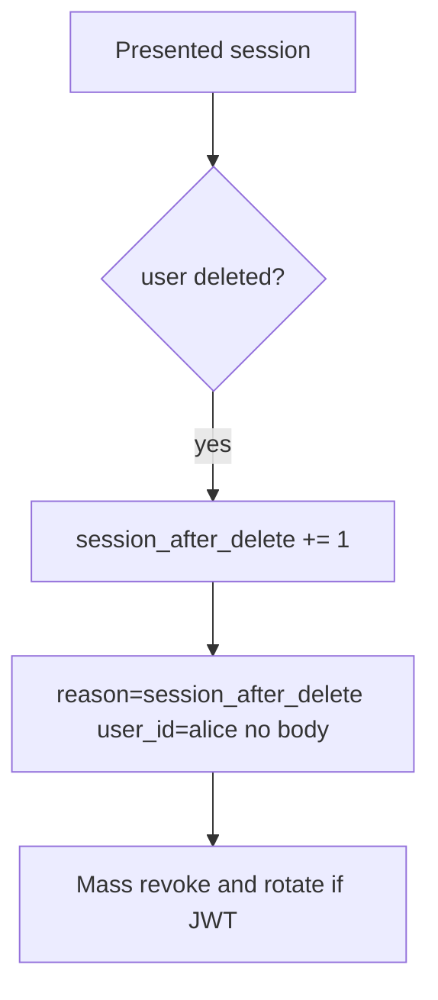

# Notice session-after-delete; mass-revoke without logging bodies

**Kind:** operations-exercise
**Loop step:** 6 Operate

## Stopping it is not enough

Even after `delete_user` was fixed once, a replica session store, a refresh token, or a worker can still present `alice`. Running it for real is the rest of the loop: notice, contain, mass-revoke, and refuse to “help” by logging note bodies.

Do not paste a personal email or a production cookie into the ticket. Do not log note bodies.

## Picture: alert on use after deleted

A leftover cookie after delete is a notice-and-recover problem, not a licence to quote notes in the paging channel. Notice names the event. Recover mass-revokes. Neither reprints the body.



Noticing, responding, and recovering still need an owner. They do not pick a log product. They do not kill the cookie.

## Signals that do not become a second leak

| Outcome | This topic |
|---|---|
| Notice | `session_after_delete`; offboarding checklist (later) |
| What the line holds | user id, request id — **never** the body or a real email |
| Respond | Mass revoke; stop the replica that still has `alice` |
| Recover | Mass revoke; rotate signing keys if tokens self-verify; re-run `test_deleted_user_session_is_dead` |
| Leftover | Backups still contain the row; workers; a phone's offline cache |

A log line a reviewer can accept looks like:

```text
log_denied reason=session_after_delete user_id=alice request_id=req_41lc
```

Not: a note body, a personal email, a production cookie, or “single sign-on revoked it.”

If your alert includes a note body, you have opened a second leak in the paging channel.

A green identity-provider tile that says “user disabled” is not that check. If a replica session store still has `alice`, treat it as the same leftover session, not a separate “eventual consistency” pass. An “account deleted” email is not recovery.

## What the framework does vs what you still have to check

An identity-provider dashboard will show “user disabled” and stay silent when a self-contained token still verifies. Detection must observe **session_valid after deleted**, not the HR ticket. SessionMiddleware does not emit this alert for you.

## Can people still use it

If operators see a “signed out” badge, do not encode it as color only. Give it a name or text a screen reader can speak. The badge is not the kill.

## Practice

Write one log line you would accept in review (ids, reason, no body). Tie it to `labs/4.1/4.1-lab`. Reject any line that includes a note body, a personal email, a production cookie, or “single sign-on revoked it.”

## Use it somewhere new

A clinic example: notice chart use after badge disable; do not paste the chart into the ticket. Do not query a live identity provider.

## What this page is not doing

A vendor name is not this week's rule. Do not run live queries against a production identity provider. Answer keys are not on this site.
