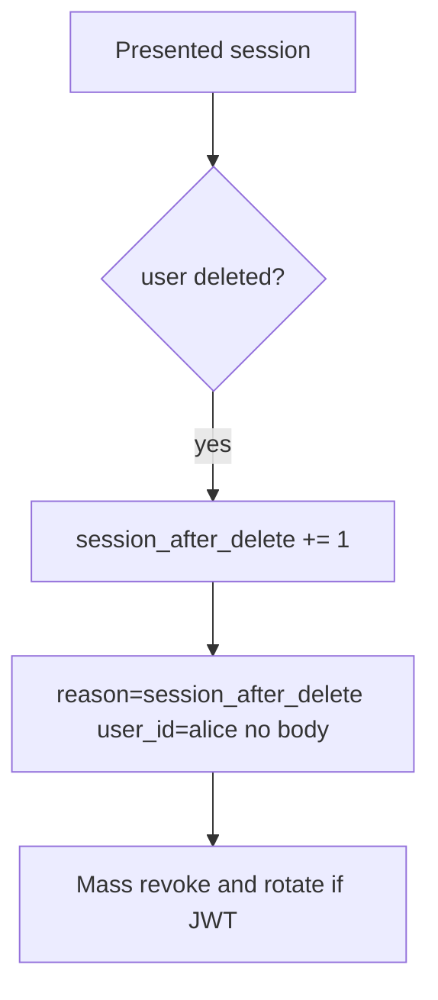

# 4.1-LO-06 — Detect session-after-delete; mass-revoke without logging bodies

**Kind:** operations-exercise
**Loop step:** 6 Operate
**Standards:** NIST CSF 2.0 (final) DE/RS/RC as outcome labels; OWASP ASVS 5.0.0 (final) `v5.0.0-7.4.2`.

## Prevention is not absolute

A replica session store, a refresh token, or a worker can still present `alice`. Pair detect and recover. Do not log note bodies (3.1).

## Mental model: alert on use after deleted



| Outcome | This module |
|---|---|
| Detect | `session_after_delete`; offboarding checklist (10.1) |
| Signal | user id, request id; never the body or a real email |
| Recover | Mass revoke; rotate signing keys if tokens self-verify |
| Residual | Backups still contain the row (5.1) |

## Practice

Write one log line you would accept. Tie it to `labs/4.1/4.1-lab`.

```
log_denied reason=session_after_delete user_id=alice request_id=req_41lc
```

Reject any line that includes a note body or a personal email.

## Transfer

Clinic: detect EHR use after badge disable; do not paste the chart into the ticket.

## Non-goals

SIEM product names are not the property.
