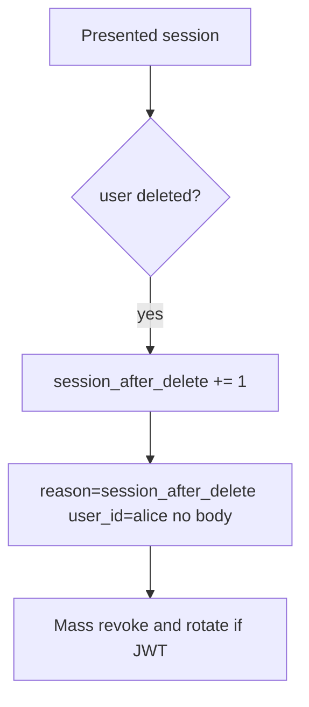

# Notice session-after-delete; mass-revoke without logging bodies

**Kind:** operations-exercise
**Loop step:** 6 Operate

## Fixing it once is not enough

A replica session store, refresh token, or worker can still present `alice` after `delete_user` pops the session. Notice that leftover, contain the replica store, mass-revoke `alice`, and do not log note bodies.

Keep personal emails, production cookies, and note bodies out of the ticket.

## Picture: alert on use after deleted

After delete, a leftover cookie must not put notes in the pager. Then mass-revoke.



A log product does not kill the cookie.

## Signals that do not become a second leak

| Outcome | This topic |
|---|---|
| Notice | `session_after_delete`; offboarding checklist (later) |
| What the line holds | user id, request id — **never** the body or a real email |
| Respond | Mass revoke; stop the replica that still has `alice` |
| Recover | Mass revoke; rotate signing keys if tokens self-verify; re-run `test_deleted_user_session_is_dead` |
| Leftover | Backups still contain the row; workers; a phone's offline cache |

```text
log_denied reason=session_after_delete user_id=alice request_id=req_41lc
```

Not: a note body, a personal email, a production cookie, or “single sign-on revoked it.”

Putting a note body in the alert leaves a leftover copy in the pager.

A green identity-provider tile that says “user disabled” is not that check. If a replica session store still has `alice`, treat it as the same leftover session, not a separate “eventual consistency” pass. An “account deleted” email is not recovery.

## What the framework does vs what you still have to check

An identity-provider dashboard will show “user disabled” and stay silent when a self-contained token still verifies. Detection must observe **session_valid after deleted**, not the HR ticket. SessionMiddleware does not emit this alert for you.

## Can people still use it

If operators see a “signed out” badge, do not encode it as color only. Give it a name or text a screen reader can speak. The badge is not the kill.

## Practice

Sketch a deny line with ids and a reason — never the body. Skip any line with a note body, a personal email, a production cookie, or “single sign-on revoked it.”

## Use it somewhere new

Notice chart use after badge disable; do not paste the chart into the ticket. Do not query a live identity provider.

## What this page is not doing

Do not run live queries against a production identity provider. Answer keys are not on this site.
