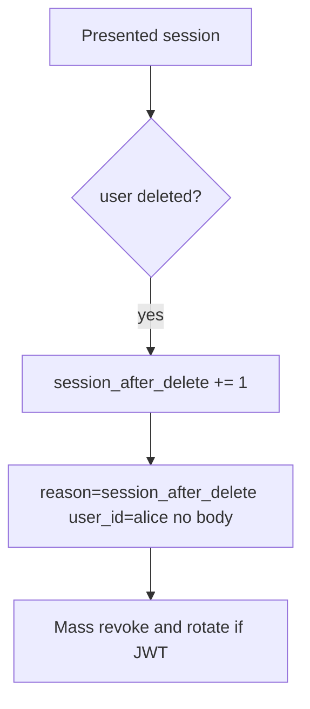

# 4.1-LO-06 — Detect session-after-delete; mass-revoke without logging bodies

**Kind:** operations-exercise
**Loop step:** 6 Operate
**Standards:** NIST CSF 2.0 (final) DE/RS/RC as outcome labels; OWASP ASVS 5.0.0 (final) `v5.0.0-7.4.2`. CSF names outcomes; it does not kill the cookie.

## Prevention is not absolute

A replica session store, a refresh token, or a worker can still present `alice` after `delete_user` was “fixed once.” Pair detect and recover. Do not log note bodies (3.1). Do not paste a personal email or a production cookie into the ticket.

## Mental model: alert on use after deleted



| Outcome | This module |
|---|---|
| Detect | `session_after_delete`; offboarding checklist (10.1) |
| Signal | user id, request id; never the body or a real email |
| Recover | Mass revoke; rotate signing keys if tokens self-verify |
| Residual | Backups still contain the row (5.1); workers (7.4); mobile cache (8.2) |

CSF 2.0 Detect / Respond / Recover name outcomes. They do not prove `v5.0.0-7.4.2`. A SIEM product name is not the property. An “account deleted” email is not recovery. Re-run `test_deleted_user_session_is_dead` after any offboarding change; a green IdP “user disabled” tile is not that pytest. If a replica session store still has `alice`, treat it as the same forbidden outcome, not a separate “eventual consistency” pass.

## Framework defaults versus the operate guarantee

An IdP dashboard will show “user disabled” and stay silent when a self-contained JWT still verifies. Detection must observe **session_valid after deleted**, not the HR ticket. If the alert includes a note body, you have opened a 3.1 cell.

## Practice

Write one log line you would accept. Tie it to `labs/4.1/4.1-lab`.

```text
log_denied reason=session_after_delete user_id=alice request_id=req_41lc
```

Reject any line that includes a note body, a personal email, a production cookie, or “SSO revoked it.”

## Transfer

Clinic: detect EHR use after badge disable; do not paste the chart into the ticket. Do not query a live IdP.

## Usability

If operators see a “signed out” badge, do not encode it as color-only (WCAG 2.2 Success Criterion 1.4.1). Announce status (4.1.3) without claiming revocation.

## Non-goals

SIEM product names are not the property. Live IdP audits are out of scope. Gates 0–10 stay not-attempted.
