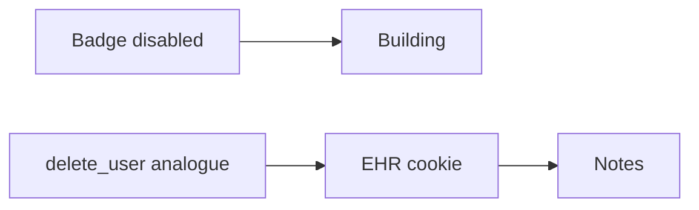

# Same idea when a clinician leaves

**Kind:** transfer-challenge
**Loop step:** 7 Transfer

## Use it somewhere new

You get a **clinic offboard**. A badge system and a browser session sit next to each other.

On the notes app, after `delete_user("alice")`, `session_valid("alice")` is false. When a clinician leaves, leftover must die in the same delete.

## Picture: badge off is not session off

Calling it “clinician” instead of “alice” does not move the work. Disabling the badge does not authorize leaving the chart cookie alive. A logout product name is not the check.

| Notes app this week | Clinic sketch |
|---|---|
| `alice` session cookie | Chart browser cookie |
| `delete_user` | Offboard analogue |
| `session_valid` after delete | Chart session still valid after badge off |
| Ex-employee with copied cookie | Copied cookie; shared workstation |
| Delayed worker holding `user_id` | Delayed lab-result worker — **not** a live clinic |

If offboard only hits the badge, the chart cookie still reads. Identity guidance separates identifiers, authenticators, and session. The session leftover is still the point. FastAPI, SessionMiddleware, and a badge vendor webhook do not pop `SESSIONS["alice"]`. A delayed lab-result worker that still holds `user_id` is later work — name it as leftover. Do not pretend the chart-cookie test covers it.

## Prompt — departing clinician

1. who can act (copied cookie; shared workstation; delayed lab-result worker — **not** a live clinic or identity provider);
2. what you trust (which delete path is trusted; the badge vendor is not);
3. what must not happen (`session_valid` true after offboard, not a legal label);
4. a test idea on **local** files only (`delete_user` analogue then `session_valid` false — never on the real clinic);
5. leftover (backups; phone cache; token `exp`; worker `user_id`);
6. whether a human-read “you are signed out” status must not use color as the only cue.

## What is not good enough

| Reject | Why |
|---|---|
| “Single sign-on will revoke” without a test | Tool theater |
| Live clinic identity provider | Course rules |
| Profile DELETE as the rule | Leftover still live |
| A legal label as the check | Awareness, not this check |
| HTTP 200 as lifecycle evidence | Wrong observation |

## Practice

One page. No answer keys. The only running system you may break is `labs/4.1/4.1-lab`. Do not disable a real badge or replay a chart cookie.

## What this page is not doing

Live-target token replay. Real HR exports. This page does not finish a check-in.
