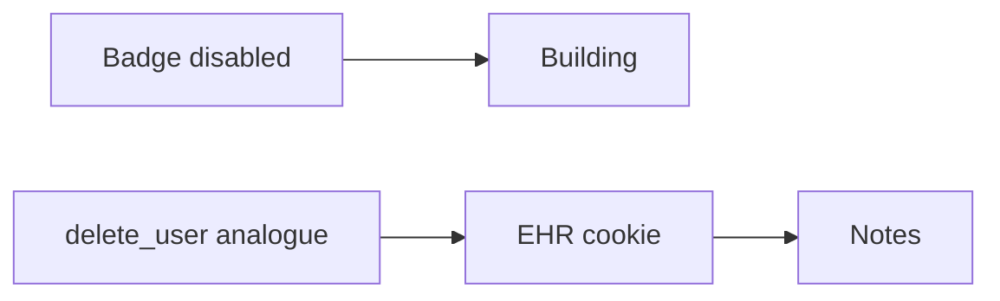

# 4.1-LO-07 — Transfer: departing clinician

**Kind:** transfer-challenge
**Loop step:** 7 Transfer
**Standards:** NIST SP 800-63-4 (final); OWASP ASVS 5.0.0 (final) `v5.0.0-7.4.2`.

## Change the workplace; keep artifact-must-die

Do not answer with a Top 10 / CWE / scanner as the definition of security.

**Prompt:** Clinic: departing clinician.

**Product sketch:** EHR-lite with a badge system and a browser session.

Rewrite the SecureCollab sentence. Include:

1. attacker capabilities (copied cookie; shared workstation; delayed lab-result worker — not a live clinic);
2. trust assumptions (which delete use-case is TCB; badge vendor is not);
3. forbidden outcome (`session_valid` true after offboard, not “HIPAA”);
4. a test idea on a **local** fixture only;
5. residual (backups; mobile cache; JWT exp);
6. WCAG 2.2 if a human-mediated recovery/offboard path is in the claim (usable “you are signed out” status — 4.1.3).

## Mental model: badge off is not session off

If offboard only hits the badge, the chart cookie still reads.

## What graders reject

| Reject | Why |
|---|---|
| “SSO will revoke” without a test | Mechanism theater |
| Live clinic IdP | Lab policy |
| Profile DELETE as the property | Artifact still live |

## Practice

One page. No keys. `labs/4.1/4.1-lab` is the only running system you may break.
