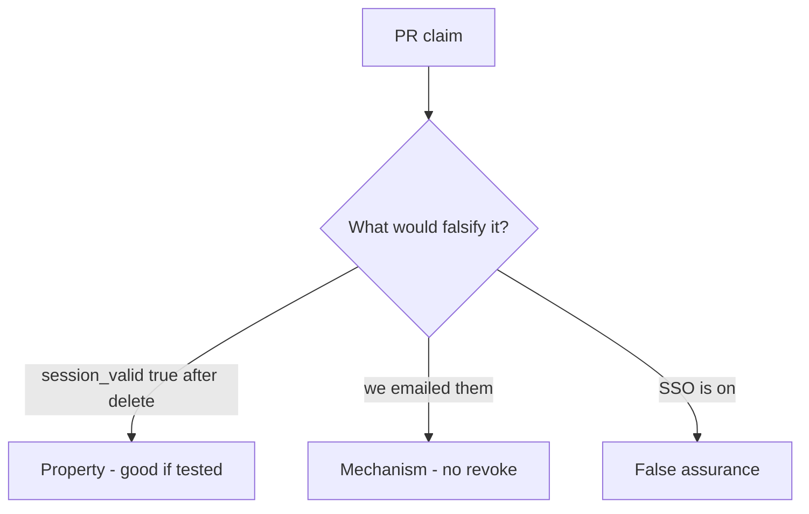

# 4.1-LO-08 — Review leftover session as a PR, not an HR ticket

**Kind:** code-review
**Loop step:** Review
**Standards:** OWASP ASVS 5.0.0 (final) `v5.0.0-7.4.2`.

## Review the fixture as if it were SecureCollab offboarding

Review `labs/4.1/4.1-lab/vulnerable/` as a SecureCollab PR. Intended findings live only in `content/assessment/keys/4.1.md` — not here.

## Mental model: property, mechanism, or false assurance

Seeded smells (label them yourself; do not open the keys file):

- `DELETE FROM users` without session purge
- JWT `exp` 30d ignored on delete
- Worker still has `user_id`
- No test `session_valid` after delete

Also reject: client trust, closing findings without retest, keys in lessons, real PII in fixtures.

## Misconceptions

- Disable login is enough
- SSO magically revokes
- Deleted means gone from backups

## Practice

Write three review notes. Tie at least one to `test_deleted_user_session_is_dead`.

## Transfer

Clinic PR that “disables the badge” without killing the EHR session is incomplete.
