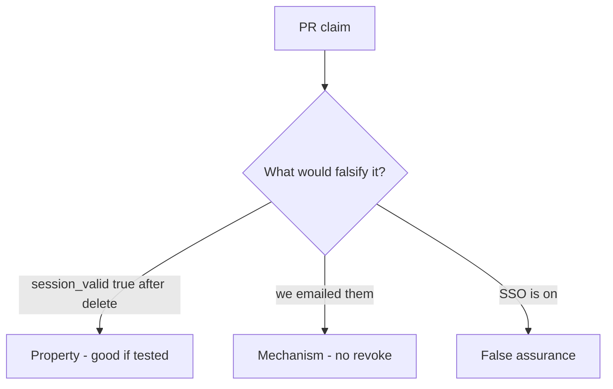

# 4.1-LO-08 — Review leftover session as a PR, not an HR ticket

**Kind:** code-review
**Loop step:** Review
**Standards:** OWASP ASVS 5.0.0 (final) `v5.0.0-7.4.2`. NIST SP 800-63-4 (final) as lifecycle vocabulary, not an SSO product.

## Review the fixture as if it were SecureCollab offboarding

Review `labs/4.1/4.1-lab/vulnerable/` as a SecureCollab PR. Your job is not to count suspicious lines. Reconstruct whether `session_valid("alice")` is still true after `delete_user`, compare that with the module invariant, and write changes a developer can verify.

Intended findings live only in `content/assessment/keys/4.1.md` — not here. Do not open the keys file until your review has been evaluated.

## Mental model: DELETE FROM users without session purge

Start with this seeded smell: **`DELETE FROM users` without session purge**. Label it property, mechanism, or false assurance before you accept the PR.

Classification starts at the protected effect (session dead after delete). Everything that is not artifact kill in that use-case is a candidate ambient path.

## Seeded smells (label them yourself)

- `DELETE FROM users` without session purge
- JWT `exp` 30d ignored on delete
- Worker still has `user_id`
- No test `session_valid` after delete

Also reject: client trust; closing findings without re-running `test_deleted_user_session_is_dead`; keys in lessons; real PII in fixtures; production cookies in the review notes.

## Misconceptions this module refuses

- Disable login is enough
- SSO magically revokes
- Deleted means gone from backups
- SessionMiddleware knows HR
- An “account deleted” email is `v5.0.0-7.4.2`

## Practice

Write three review notes a maintainer could act on. Each note: observation, property or false assurance, suggested structural change, residual you will **not** delete. Tie at least one to `test_deleted_user_session_is_dead`.

## Transfer

Clinic PR that “disables the badge” without killing the EHR session is an incomplete mediation review. Name the independent falsehood that would still keep `session_valid` false after offboard.

## Non-goals

Do not merge by adding a comment “will revoke sessions later.” That comment is a residual without an owner. Do not replay a live cookie to prove the finding.
