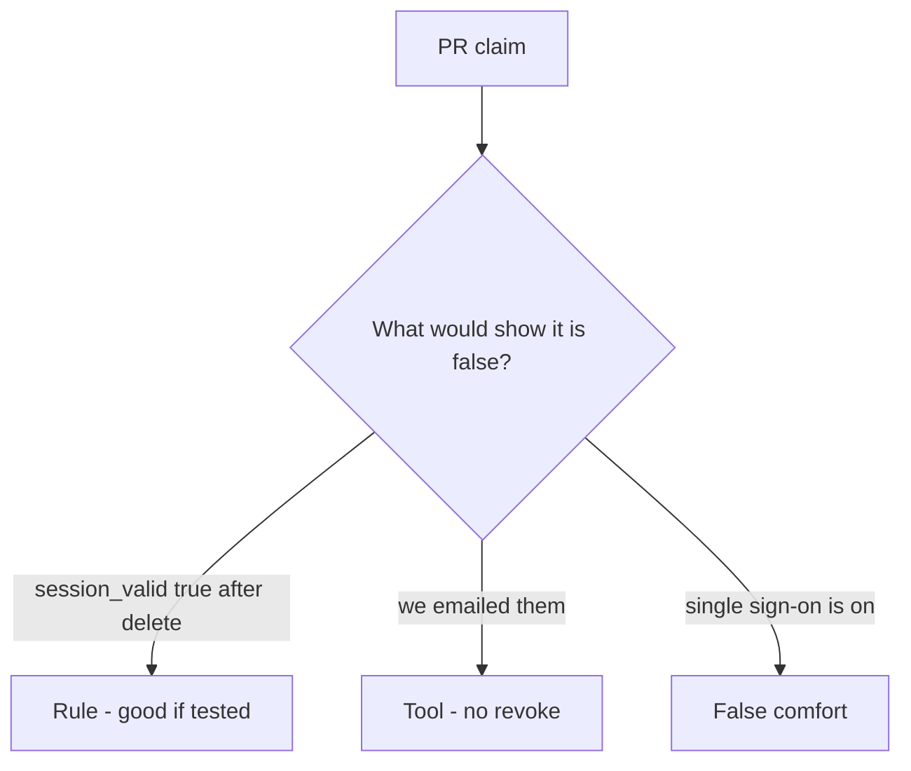

# Review of a leftover session after delete

**Kind:** code-review
**Loop step:** Review

Intended findings live only in the answer-key folder — not here. Do not open that file until your review has been evaluated.

## What you are reviewing

A colleague ships notes-app offboarding. Your job is to label each claim **rule**, **tool**, or **false comfort**, and to say whether `session_valid("alice")` is still true after `delete_user` if they ship. Start at the leftover session after delete, not at a scanner color or an HR ticket.

The folder `labs/4.1/4.1-lab/vulnerable/` is the change. The check you already ran (`test_deleted_user_session_is_dead`) is the rule test. A comment “will revoke sessions later” is not.

## Picture: problems to find (name them yourself)

Start with this seeded smell: **`DELETE FROM users` without session purge**. Label it rule, tool, or false comfort before you accept the change.

The review starts at the protected effect (session dead after delete). Everything that is not leftover-kill in that same delete is a candidate extra path.

## Seeded smells (label them yourself)

- `DELETE FROM users` without session purge
- Token `exp` 30d ignored on delete
- Worker still has `user_id`
- No test `session_valid` after delete

Also reject: trusting the browser as the vault; closing findings without re-running `test_deleted_user_session_is_dead`; keys in learner notes; real people's data in the practice files; production cookies in the review notes.

## Common mix-ups

- Disable login is enough
- Single sign-on magically revokes
- Deleted means gone from backups
- SessionMiddleware knows HR
- An “account deleted” email is the kill

## Practice

Write three review notes a maintainer could act on. Each note: what you saw, rule or false comfort, suggested structural change, leftover you will **not** delete. Tie at least one note to `test_deleted_user_session_is_dead`. Do not open the keys file.

## Use it somewhere new

Clinic change that “disables the badge” without killing the chart session is an incomplete review of leftover access. Name the independent falsehood that would still keep `session_valid` false after offboard.

## Can people still use it

If the dashboard shows a signed-out badge, do not encode it as color only. That is a cue for operators, not the kill.

## What this page is not doing

Do not merge by adding a comment “will revoke sessions later.” That comment is leftover without an owner. Do not replay a live cookie to prove the finding.
