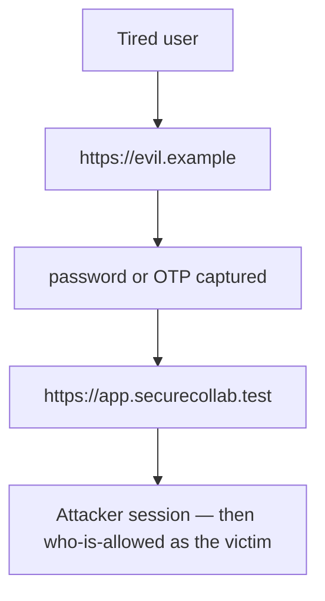
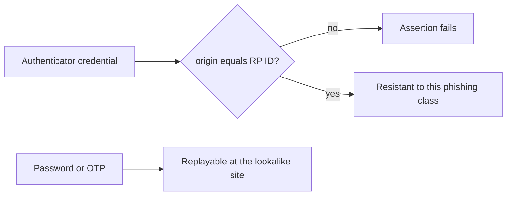

# A password at a lookalike site is not phishing-resistant

**Kind:** concept-model
**Loop step:** 1 Property

## The rule

The notes app logs a browser user in at `https://app.securecollab.test`. A password or one-time code typed at `https://evil.example` is a **shared secret the attacker now has**. That is not phishing-resistant, even if the real site later accepts the same secret. A WebAuthn-class authenticator is tied to the relying-party origin: an assertion for evil.example must fail even if the credential exists.

> `phishing_resistant("password", "https://evil.example", "https://app.securecollab.test")` must be false. `phishing_resistant("webauthn", "https://evil.example", "https://app.securecollab.test")` must be false. Passwords to the *real* origin are still phishable — do not advertise them as resistant. An HTML `autocomplete=webauthn` hint is not the ceremony.

What must not happen is a **password (or wrong-origin WebAuthn) counted as phishing-resistant**. That is a login bound to the *wrong* site, then a session that acts as the victim.

Authenticator guidance still treats passwords and OTP as phishable. “We turned on 2FA” is not this sentence. WebAuthn Level 3 is still a Candidate Recommendation, not a finished Rec. A later, stricter bar wants a hardware, user-intent, phishing-resistant factor. Treat that as later, not as this week's check.

## Picture: the secret walks to the wrong site



Nobody needs a new bug name. A lookalike login page is enough. Trusting “the user will read the URL” is not what you trust.

**A tool is not the rule.** A passkey vendor dashboard, `autocomplete=webauthn`, or “we turned on MFA” is not this sentence.

## Picture: origin binding vs a shared secret



OTP is a second factor. It is still typed into the phishing page. Prompt bombing and recovery SMS put a phishable secret back on the path. Password-only users are an honest leftover, not a slogan.

## Why it happens, what it costs, how you stop it, how you notice, how you recover

| Slice | For this rule |
|---|---|
| Why it happens | A shared secret that still works at the wrong site |
| What has to be true first | The helper returns true for a password at the lookalike origin |
| Trigger | A lookalike login page |
| What it costs | Login is bound to the *wrong* site; the session then acts as the victim |
| How you stop it | Bind the ceremony to origin / RP ID; do not call passwords resistant |
| How you notice | `webauthn_fail_origin`; a user report; a new-device signal (weak) |
| How you recover | Revoke sessions (the leftover-session topic); force a re-bind of authenticators |

## What the framework does vs what you still have to check

FastAPI does not know the RP ID. A Next.js password field will happily POST to evil.example. The login still has to work with a keyboard, a name a screen reader can use, and errors that are not color-only. A mouse-only WebAuthn button pushes people onto the password leftover — that is a security leftover, not polish.

The app’s promise is the boolean helper, not a live authenticator — files in `labs/4.2/4.2-lab`. It is not a live phishing site.

## What the tool cannot do

- WebAuthn does not decide who may read a note.
- Recovery email or SMS can put a phishable secret back on the path.
- A stolen authenticator, or prompt bombing, still mints a session.
- People who only have passwords — name that leftover; do not advertise resistance.

## Practice

Fill method × origin × expected. Then run the local pair:

```text
python3 -m pytest labs/4.2/4.2-lab/tests --impl vulnerable
python3 -m pytest labs/4.2/4.2-lab/tests --impl fixed
```

Tie the check to the password-at-lookalike boolean, not to a vendor name.

## Use it somewhere new

Step-up before export: still origin-bound? Clinic staff SSO: password MFA to a lookalike identity provider is still this sentence.

## What this page is not doing

Do not use live phishing campaigns, real user credentials, copy-paste kits. Practice stays in this folder. Answer keys are not on this site.
