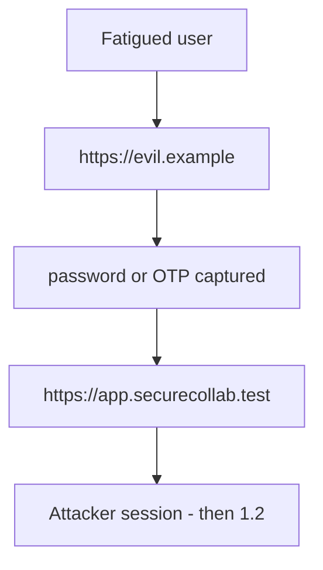
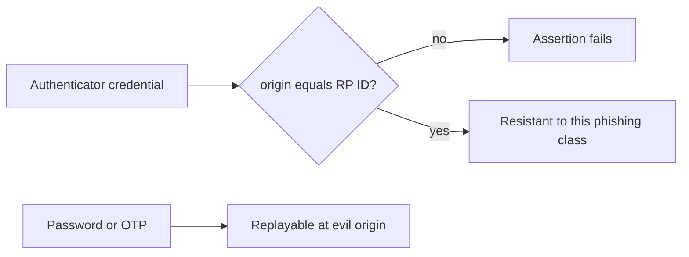

# 4.2-LO-01 — A password at a lookalike origin is not phishing-resistant

**Kind:** concept-model
**Loop step:** 1 Property
**Standards:** NIST SP 800-63B-4 (final, part of SP 800-63-4); W3C WebAuthn Level 3 (**Candidate Recommendation** — not Rec); OWASP ASVS 5.0.0 (final) `v5.0.0-6.3.3` (Level 2 MFA; the hardware phishing-resistant clause is **Level 3, advanced**); WCAG 2.2 (final) for the journey.

## The claim this module owns

SecureCollab Phase 1 authenticates a browser user to `https://app.securecollab.test`. A password or OTP typed at `https://evil.example` is a **shared secret the attacker now has**. That is not phishing-resistant, even if the real origin later accepts the same secret. WebAuthn-class authenticators are scoped to the RP origin: an assertion for evil.example must fail even if the credential exists.

> `phishing_resistant("password", "https://evil.example", "https://app.securecollab.test")` must be false. `phishing_resistant("webauthn", "https://evil.example", "https://app.securecollab.test")` must be false. Passwords to the *real* origin are still phishable — do not advertise them as resistant. HTML `autocomplete=webauthn` is not a ceremony.

The forbidden outcome is **password (or wrong-origin WebAuthn) counted as phishing-resistant**. That is a 1.1 authenticity failure: the principal is bound to the *wrong* origin, then 1.2 runs as the victim.

ASVS `v5.0.0-6.3.3` wants MFA at Level 2. The same requirement’s **Level 3** clause wants a hardware, user-intent, phishing-resistant factor — label that advanced; it is not a silent baseline. WebAuthn L3 is a **Candidate Recommendation**. 800-63B-4 distinguishes phishing-resistant authenticators from OTP and passwords. Any 2FA is not this sentence.

## Mental model: the secret walks to the wrong origin



The attacker is a lookalike origin, not a novel CVE. Trusting “the user will read the URL” is not a TCB.

**Mechanism (not the property):** a passkey vendor dashboard, `autocomplete=webauthn`, or “we turned on MFA.”

## Mental model: origin binding vs shared secret



OTP is a second factor. It is still typed into the phishing page. Prompt bombing and recovery SMS re-introduce phishable secrets (1.4, 4.1).

## Root cause vs impact vs prevention vs detection vs recovery

| Slice | For this property |
|---|---|
| Root cause | Shared secret replayable at the wrong origin |
| Preconditions | Classifier returns true for password at evil origin |
| Trigger | Lookalike login page |
| Impact | Authenticity of the principal to *this* origin |
| Prevention | Origin/RP ID binding; do not call passwords resistant |
| Detection | `webauthn_fail_origin`; user report; new-device (weak) |
| Recovery | Revoke sessions (4.1); force re-bind authenticators |

## Framework defaults versus the authenticator guarantee

FastAPI does not know RP ID. Next.js `<input type=password>` will happily POST to evil.example. WCAG 2.2 still applies: a mouse-only WebAuthn button pushes people onto the password residual. The lab guarantee is the boolean classifier, not a live authenticator. Oracle: `labs/4.2/4.2-lab`. No live phishing sites.

## Mechanism limits

- WebAuthn does not authorize (1.2).
- Recovery email/SMS can re-introduce phishable secrets.
- Compromised authenticator; prompt bombing.
- Users with only passwords — honest residual, not a slogan.

## Practice

Fill method × origin × expected. Then run:

```
python3 -m pytest labs/4.2/4.2-lab/tests --impl vulnerable
python3 -m pytest labs/4.2/4.2-lab/tests --impl fixed
```

The first command must fail. The second must pass. Map the assertion to the password-at-evil boolean, not to a vendor name.

## Transfer

Step-up for export: still origin-bound? Clinic staff SSO portal: password MFA to a lookalike IdP is still this sentence.

## Non-goals

Live phishing campaigns, real user credentials, weaponized kits. Gates 0–10 and milestones M0–M5 stay **not-attempted** without learner or product evidence. Answer keys are not in this file.

## Usability and accessibility

WebAuthn and the password fallback must work with keyboard, labels, and no color-only errors (WCAG 2.2). A broken accessible path is a security residual: people share passwords.
