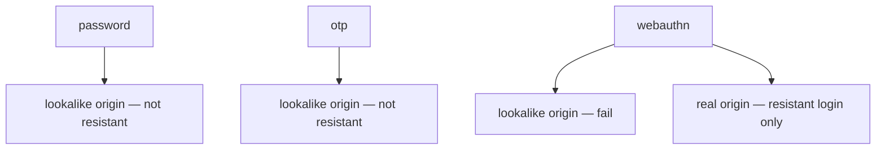
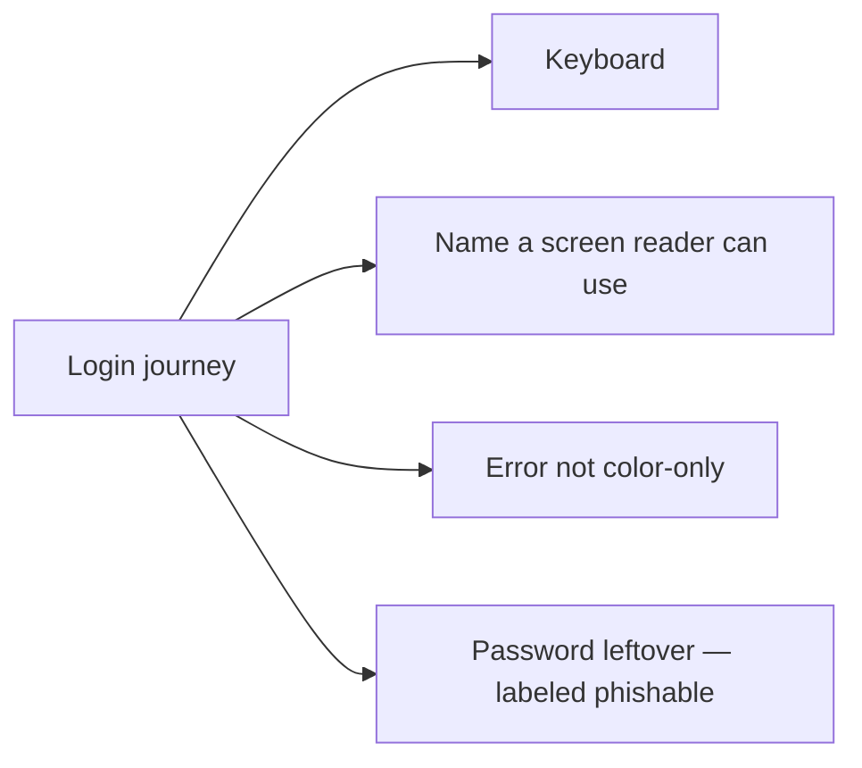

# An authenticator record someone else can test

**Kind:** design-exercise
**Loop step:** 2 Model

## Could someone else name the checks from your record?

“We use MFA” is not this lesson. A reviewable record names **method**, **origin**, **whether the claim is phishing-resistant**, and **the leftover** if only passwords remain.

This week: a local `phishing_resistant` helper; origins `https://app.securecollab.test` vs `https://evil.example`. No live authenticators.

## Picture: three methods, two origins

If the map already lets a password at evil.example count as resistant, it already predicts `test_password_is_not_phishing_resistant` will fail.

## Picture: a usable path is part of what you trust

If WebAuthn is pointer-only, the leftover grows. People share passwords.

## Step 1: name the pieces

| Piece | This system |
|---|---|
| Who | User; phishing site; real notes-app origin |
| What | password; otp; webauthn assertion; origin |
| Actions | `phishing_resistant` |
| Paths | browser; authenticator |
| What you trust | Origin-bound ceremony (the local stand-in) |
| What you do not trust | Reading the URL; password reuse |
| Time | Login now; later step-up before export |
| Login cell | Authenticity to *this* origin |

The client, the lookalike page, and “the user will notice the URL” are hostile. What you trust is the **origin check**, not “MFA is on.”

## Step 2: write cells the practice can fail

| Who | What | Action | Decision |
|---|---|---|---|
| user | password | real origin | phishable (allowed leftover) |
| user | password | lookalike origin | deny-and-not-resistant |
| user | otp | lookalike origin | deny-and-not-resistant |
| user | webauthn | lookalike origin | deny |
| user | webauthn | real origin | resistant-login-only |

A missing step-up cell is how export theater appears. Write the hole even if this week has no export button.

## Practice

Draw this map so someone else could name the checks without opening the answer-key folder. Open `authn.py` in `labs/4.2/4.2-lab`. Label password and OTP as phishable even at the real origin — the leftover is honest, not a silent pass.

## Use it somewhere new

Step-up before export. Clinic staff SSO portal. Same three methods, two origins.

## What can still go wrong

Password-only users. Recovery SMS. WebAuthn does not decide who may read a note.

## What this page is not doing

Answer keys are not on this site.
