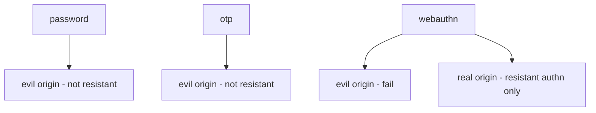
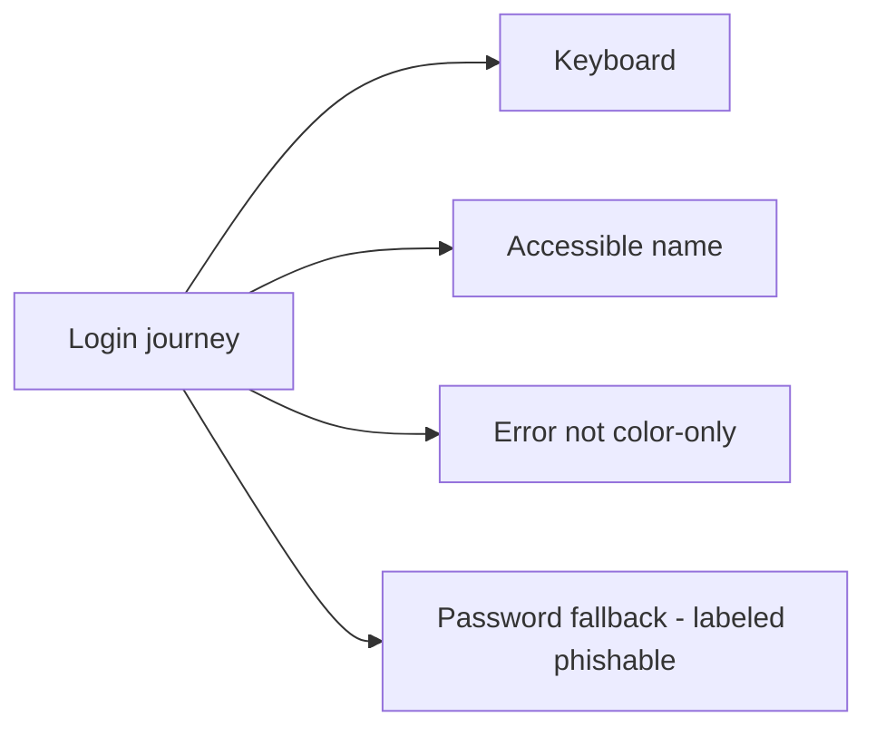

# 4.2-LO-02 — An authenticator record a second engineer can test

**Kind:** design-exercise
**Loop step:** 2 Model
**Standards:** NIST SP 800-63B-4 (final); WebAuthn Level 3 (**CR**); OWASP ASVS 5.0.0 (final) `v5.0.0-6.3.3`.

## Can a second engineer name pytest cases from your decision record?

“We use MFA” is not this lesson. A reviewable record names **method**, **origin**, **whether the claim is phishing-resistant**, and **the residual** if only passwords remain.

SecureCollab Phase 1 freeze: local `phishing_resistant` classifier; origins `https://app.securecollab.test` vs `https://evil.example`. No live authenticators.

## Mental model: three methods, two origins

## Mental model: usability is in the TCB

If WebAuthn is pointer-only, the residual grows (1.4).

## Step 1: freeze pieces

| Piece | This system |
|---|---|
| Subjects | User; phishing site; real origin |
| Objects | password; otp; webauthn assertion; origin |
| Actions | `phishing_resistant` |
| Channels | browser; authenticator |
| TCB | Origin-bound ceremony (lab stand-in) |
| Untrusted | URL-reading; password reuse |
| State / time | Login; later step-up (transfer) |
| 1.1 cell | Authenticity to *this* origin |

## Step 2: write cells

| Subject | Object | Action | Decision |
|---|---|---|---|
| user | password | real origin | phishable (allowed residual) |
| user | password | evil origin | deny-and-not-resistant |
| user | otp | evil origin | deny-and-not-resistant |
| user | webauthn | evil origin | deny |
| user | webauthn | real origin | resistant-authn-only |

## Practice

Draw this map so a second engineer could name pytest cases. Point at `labs/4.2/4.2-lab` file `authn.py`.

## Transfer

Step-up for export. Clinic SSO portal.

## Residual risk

Password-only users. Recovery SMS. WebAuthn ≠ 1.2.

## Non-goals

Top 10 as the definition of security. Keys stay out of lessons.
