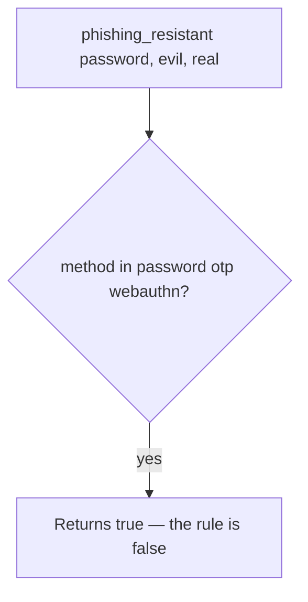

# Practice: a password counted as phishing-resistant

**Kind:** mechanism-lab
**Loop step:** 3 Break

## Try it

The practice is not a website you attack. `phishing_resistant` treats any enrolled method as true, and origin is ignored, so a password at a lookalike origin already counts as **resistant**.

> A password or OTP at a lookalike origin is not phishing-resistant. WebAuthn at the wrong origin must fail.

## Where you may practice

Stay inside `labs/4.2/4.2-lab/`. No other hosts. Synthetic origins `https://evil.example` and `https://app.securecollab.test`. It does not open a browser or an authenticator.

Do not load a lookalike login page, a public phishing kit, an employer SSO, or a classmate preview as this exercise.

What must not happen: **password (or wrong-origin WebAuthn) counted as phishing-resistant**. `phishing_resistant("password", EVIL, REAL)` returns true.

Picture a lookalike origin that can collect a typed secret — OTP typed at evil.example, or a WebAuthn assertion asked for the wrong RP ID. The helper treats shared secrets as **not** resistant, and fails WebAuthn when origin ≠ expected. A passkey vendor dashboard, `autocomplete=webauthn`, and “we turned on MFA” are not in that set.

## Picture: any enrolled method returns true



A shared secret is treated as resistant — not an exploit recipe against a public site. Method is in `{password, otp, webauthn}`; origin is ignored. You do not need a live phishing page. You must not build one.

A later hardware bar is not this check.

## What to read in the broken files

`vulnerable/authn.py` returns true for `password`, `otp`, and `webauthn` and ignores origin. Checks:

- `test_password_is_not_phishing_resistant`
- `test_otp_is_not_phishing_resistant`
- `test_webauthn_wrong_origin_fails`
- `test_webauthn_matching_origin_is_resistant` — honest path on the repaired files

## Why it happens vs what it costs

| Slice | Practice |
|---|---|
| Required rule | A password at the lookalike origin is not labeled phishing-resistant |
| Why it happens | A shared secret that still works at the wrong site |
| What's already wrong | The helper returns true for a password at the lookalike origin |
| Trigger | `phishing_resistant("password", EVIL, REAL)` |
| What it costs | Login is bound to the *wrong* site; the session then acts as the victim |
| How you stop it | Bind origin / RP ID; do not call passwords resistant |
| How you notice | `webauthn_fail_origin`; a user report |
| How you recover | Revoke sessions; force a re-bind of authenticators |
| Not the lesson | “MFA” as a marketing word, a passkey vendor name, or a live kit |

## What the framework does vs what you still have to check

FastAPI does not know the RP ID. A Next.js password field will happily POST to evil.example. Password at the lookalike origin → false.

## Practice

Run checks against the broken files (they **must fail** on the password-at-lookalike claim). Record the check name `test_password_is_not_phishing_resistant`.

```text
python3 -m pytest labs/4.2/4.2-lab/tests --impl vulnerable
```

Do not “fix” the check to pass. Do not weaken it to “we have 2FA.” A setup error is not proof the rule holds.

## Use it somewhere new

Clinic SSO lookalike. Predict without leaving this directory. Do not open a clinic identity provider or a public phishing page.

## A usable leftover

A mouse-only WebAuthn button pushes people onto the password leftover. That is a security leftover, not polish.

## What this page is not doing

No live phishing campaigns. Synthetic origins only. Re-run the checks when you are done. No leftover state.
