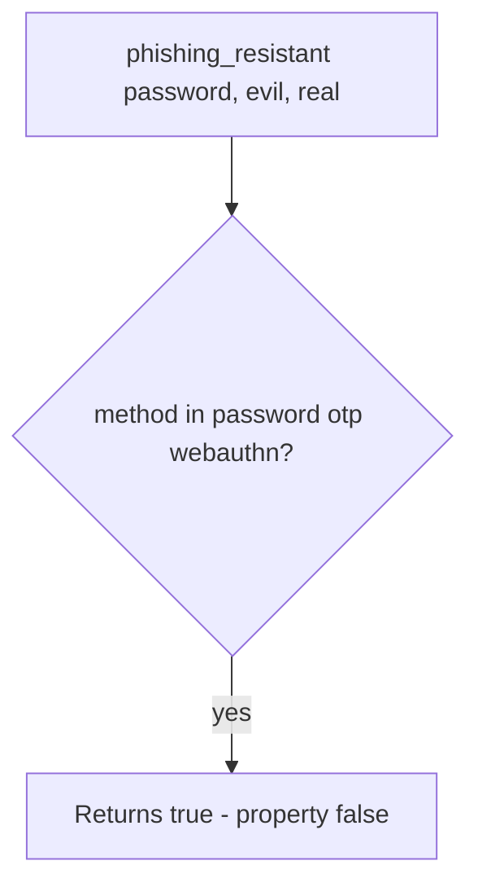

# 4.2-LO-03 — Observe the password counted as resistant, do not trophy a kit

**Kind:** mechanism-lab
**Loop step:** 3 Break
**Standards:** OWASP ASVS 5.0.0 (final) `v5.0.0-6.3.3`; WebAuthn Level 3 (**Candidate Recommendation**, not Rec). NIST SP 800-63B-4 (final) distinguishes phishing-resistant authenticators from OTP and passwords.

## Authorized scope

`labs/4.2/4.2-lab` only. The fixture is an in-process `phishing_resistant` classifier. Synthetic origins `https://evil.example` and `https://app.securecollab.test`. It does not open a browser or an authenticator. Do not load a lookalike login page, a public phishing kit, an employer SSO, or a classmate preview as this exercise.

**Forbidden outcome:** password (or wrong-origin WebAuthn) counted as phishing-resistant. `phishing_resistant("password", EVIL, REAL)` returns true.

Attacker capability in this lab: a lookalike origin that can collect a typed secret. That stands in for OTP typed at evil.example, or a WebAuthn assertion requested for the wrong RP ID. Trust assumption: the classifier is supposed to treat shared secrets as **not** resistant, and to fail WebAuthn when origin ≠ expected. A passkey vendor dashboard, `autocomplete=webauthn`, and “we turned on MFA” are not in the TCB for this cell.

## Mental model: any enrolled method returns true



The vulnerable tree demonstrates **cause** (shared secret treated as resistant), not a trophy kit against a public site. Preconditions: method is in `{password, otp, webauthn}`; origin is ignored. You do not need a live phishing page. You must not build one.

ASVS `v5.0.0-6.3.3` wants MFA at Level 2. The same requirement’s **Level 3** clause wants a hardware, user-intent, phishing-resistant factor — label that advanced; it is not this pytest.

## What to read in the fixture

`vulnerable/authn.py` returns true for `password`, `otp`, and `webauthn` and ignores origin. Tests:

- `test_password_is_not_phishing_resistant`
- `test_otp_is_not_phishing_resistant`
- `test_webauthn_wrong_origin_fails`
- `test_webauthn_matching_origin_is_resistant` — honest path on the fixed tree

You do not need a new origin string. The failure of `test_password_is_not_phishing_resistant` *is* the evidence.

Do not open the fixed tree yet. Diagnose the cause first.

## Root cause vs impact vs prevention vs detection vs recovery

| Slice | This lab |
|---|---|
| Required property | Password at evil origin is not labeled phishing-resistant |
| Root cause | Shared secret replayable at the wrong origin |
| Preconditions | Classifier returns true for password at evil origin |
| Trigger | `phishing_resistant("password", EVIL, REAL)` |
| Impact | Authenticity of the principal to *this* origin; then 1.2 as the victim |
| Prevention | Origin/RP ID binding; do not call passwords resistant |
| Detection | `webauthn_fail_origin`; user report |
| Recovery | Revoke sessions (4.1); force re-bind authenticators |
| Not the lesson | “MFA” as a marketing word, a passkey vendor name, or a live kit |

## Framework defaults versus the authenticator guarantee

FastAPI does not know RP ID. Next.js `<input type=password>` will happily POST to evil.example. The application guarantee is: **this** fixture, password at evil → false.

## Practice

```text
python3 -m pytest labs/4.2/4.2-lab/tests --impl vulnerable
```

Record `test_password_is_not_phishing_resistant`. Do not weaken it to “we have 2FA.” An environment error is not security evidence.

## Transfer

Clinic SSO lookalike. Predict without leaving this directory. Do not open a clinic IdP or a public phishing page.

## Usability

A mouse-only WebAuthn button pushes people onto the password residual (WCAG 2.2). That is a security residual, not a polish item.

## Non-goals

No live phishing campaigns. Synthetic origins only.
