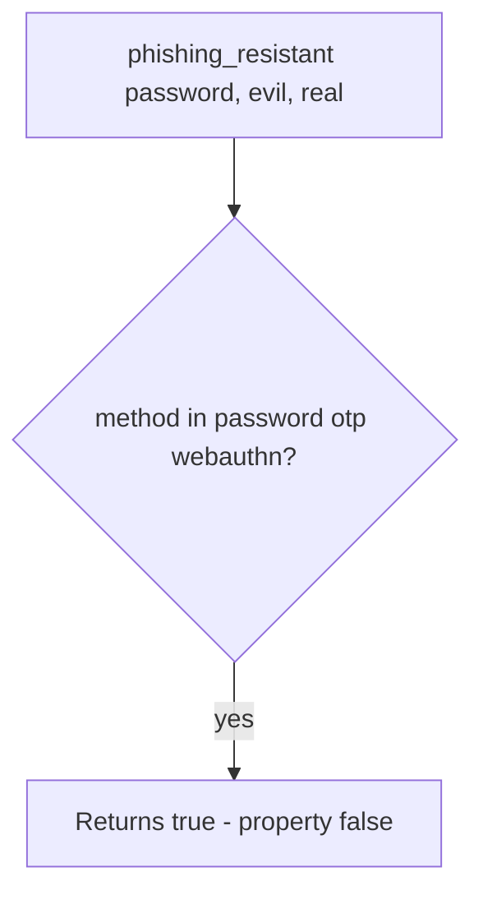

# 4.2-LO-03 — Observe the password counted as resistant, do not trophy a kit

**Kind:** mechanism-lab
**Loop step:** 3 Break
**Standards:** OWASP ASVS 5.0.0 (final) `v5.0.0-6.3.3`; WebAuthn Level 3 (**CR**).

## Authorized scope

`labs/4.2/4.2-lab` only. Synthetic origins `https://evil.example` and `https://app.securecollab.test`. No live phishing sites.

**Forbidden outcome:** Password (or wrong-origin WebAuthn) counted as phishing-resistant.

## Mental model: any enrolled method returns true



The vulnerable tree demonstrates **cause** (shared secret treated as resistant), not a trophy kit against a public site.

## What to read in the fixture

`vulnerable/authn.py` returns true for `password`, `otp`, and `webauthn` and ignores origin. Tests require password and OTP at the evil origin to be false, and WebAuthn at the evil origin to be false.

## Root cause vs impact

| Slice | Lab |
|---|---|
| Root cause | Shared secret replayable at the wrong origin |
| Impact | Attacker session at the real app (then 1.2) |
| Not the lesson | “MFA” as a marketing word |

## Practice

```
python3 -m pytest labs/4.2/4.2-lab/tests --impl vulnerable
```

Record `test_password_is_not_phishing_resistant`. Do not weaken it to “we have 2FA.”

## Transfer

Clinic SSO lookalike. Predict without leaving this directory.

## Non-goals

No live-target instructions. Synthetic data only.
