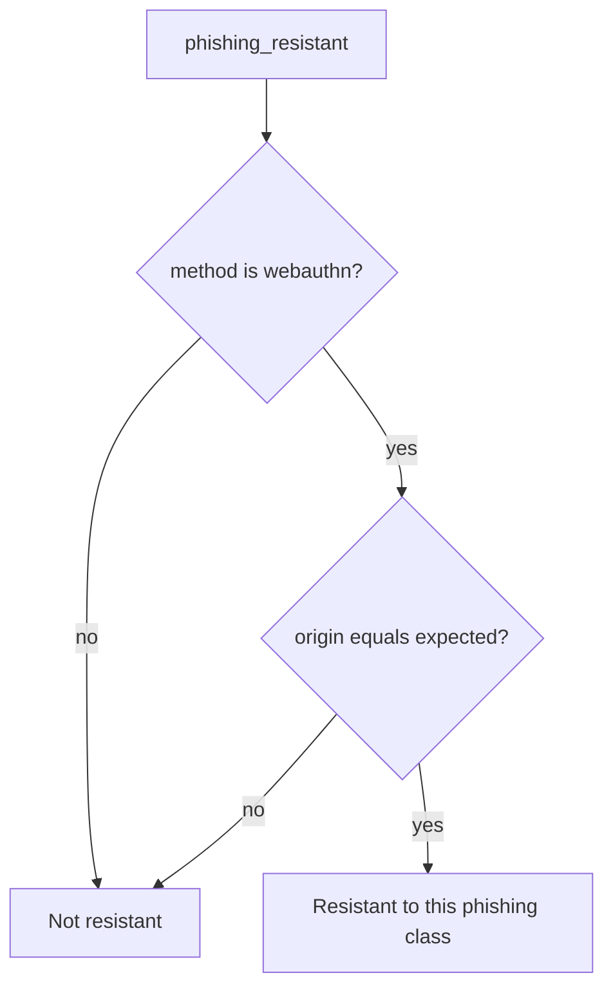

# Only origin-bound WebAuthn may claim resistance

**Kind:** design-exercise
**Loop step:** 4 Build

## The rule

A denylist of yesterday’s hostnames is not the fix. Training people to read the URL is not the fix. “We use Okta” is not the fix. `autocomplete=webauthn` is not the fix.

The structural change is: `phishing_resistant` returns false unless the method is `webauthn` **and** `origin == expected`. Origin / RP ID is in the predicate.

The smallest restore for notes-app login copy is: passwords and OTP never claim resistance; WebAuthn claims it only when origin matches the relying party. Fail closed: an unknown method denies. Passwords at the *real* origin may still log someone in; they must not be *labeled* resistant.

## Picture: method, then origin



The repaired files branch on method, then origin equality. A live WebAuthn path still needs a keyboard and a name a screen reader can use. Prompt bombing and recovery SMS put a phishable secret back on the path — name them as leftovers, not silent passes.

“2FA exists” is not this pytest. This pytest is the **phishing-resistant claim**.

## What the repaired files must show

| After the fix | Must be true |
|---|---|
| password + lookalike origin | false |
| otp + lookalike origin | false |
| webauthn + lookalike origin | false |
| webauthn + real origin | true |

Fail closed: on an unknown method, **deny**. Do not repair by returning true because “the method is enrolled.”

## What this is not

- Any 2FA.
- WebAuthn as who-is-allowed.
- SMS recovery as the default.
- A later hardware bar as an unlabeled baseline.
- A passkey vendor dashboard.
- HTML autocomplete.

## What the tool cannot do

- WebAuthn does not decide who may read a note.
- Recovery email or SMS can put a phishable secret back on the path.
- A stolen authenticator; prompt bombing.
- People who only have passwords — honest leftover, not a slogan.
- Step-up before export still needs origin binding, or the second factor is theater.

## Practice

Name method, origin, and the predicate (webauthn **and** origin == expected). Run `--impl fixed` (must pass):

```text
python3 -m pytest labs/4.2/4.2-lab/tests --impl fixed
```

Then write one sentence: which rule is restored, and which leftover you refused to delete.

## Use it somewhere new

Step-up before export still needs origin binding. Clinic staff SSO: OTP to a lookalike identity provider stays false.

## What can still go wrong

Password-only users; recovery paths; a stolen authenticator; a mouse-only ceremony.

## A usable leftover

WebAuthn and the password leftover must work with a keyboard, labels, and errors that are not color-only. A broken accessible path is a security leftover: people share passwords.
