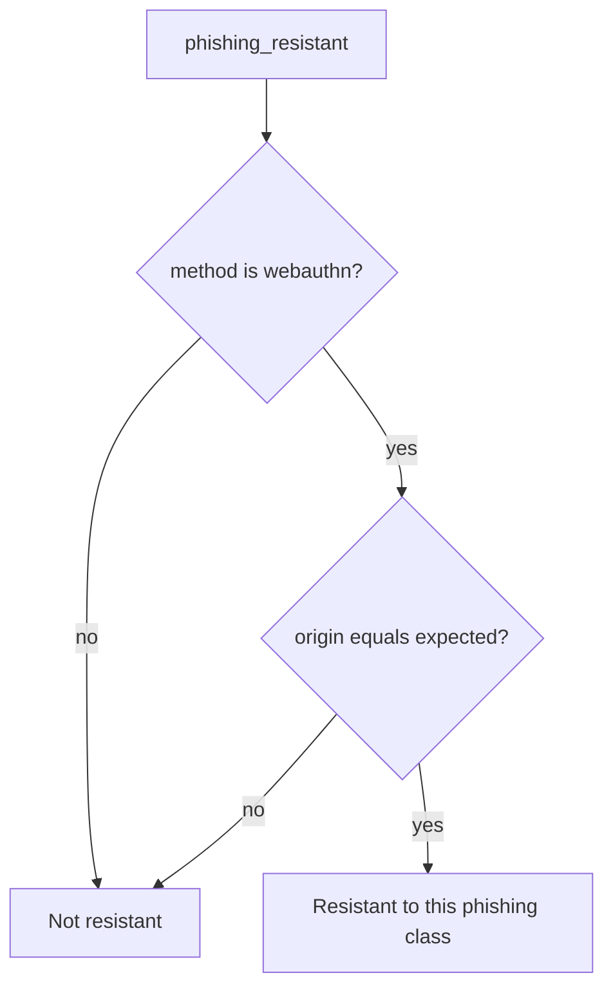

# 4.2-LO-04 — Only origin-bound WebAuthn may claim resistance

**Kind:** design-exercise
**Loop step:** 4 Build
**Standards:** WebAuthn Level 3 (**CR**); OWASP ASVS 5.0.0 (final) `v5.0.0-6.3.3`.

## Structural means evil origin cannot pass as resistant

`phishing_resistant` must return false unless the method is `webauthn` **and** `origin == expected`. Structural means origin/RP ID is in the predicate — not a denylist of hostnames, not `autocomplete=webauthn`, not “users are trained.”

## Mental model: method then origin



Passwords at the real origin may still authenticate; they must not be *labeled* resistant. OTP is the same.

## Why this restores the cell

| After the fix | Must be true |
|---|---|
| password + evil | false |
| otp + evil | false |
| webauthn + evil | false |
| webauthn + real | true |

## What this is not

Any 2FA. WebAuthn as 1.2. SMS recovery as default. Level 3 hardware clause as an unlabeled baseline.

## Practice

Name method, origin, predicate. Run:

```
python3 -m pytest labs/4.2/4.2-lab/tests --impl fixed
```

Must pass.

## Transfer

Step-up for export still needs origin binding.

## Residual risk

Password-only users; recovery paths; compromised authenticator.
