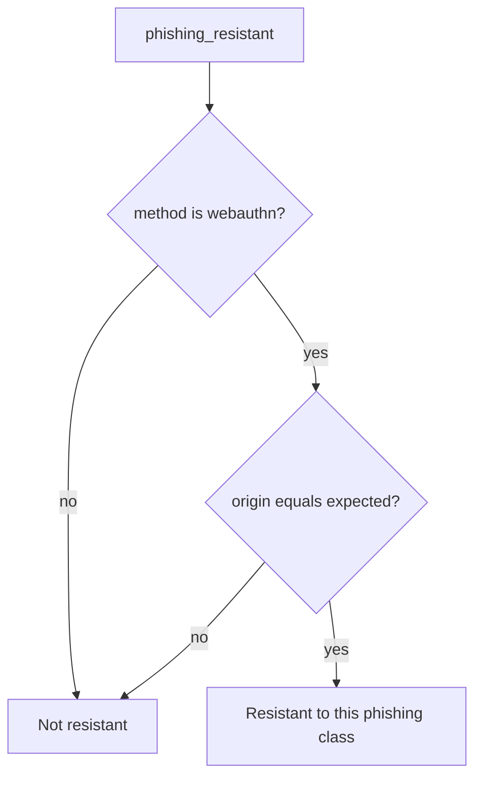

# 4.2-LO-04 — Only origin-bound WebAuthn may claim resistance

**Kind:** design-exercise
**Loop step:** 4 Build
**Standards:** WebAuthn Level 3 (**Candidate Recommendation**); OWASP ASVS 5.0.0 (final) `v5.0.0-6.3.3`. The Level 3 hardware clause is **advanced**, not this pytest.

## Structural means evil origin cannot pass as resistant

`phishing_resistant` must return false unless the method is `webauthn` **and** `origin == expected`. Structural means origin/RP ID is in the predicate — not a denylist of hostnames, not `autocomplete=webauthn`, not “users are trained,” not “we use Okta.”

The smallest restore for SecureCollab Phase 1 login copy is: passwords and OTP never claim resistance; WebAuthn claims it only when origin matches the RP. Fail-safe: unknown method denies. Passwords at the *real* origin may still authenticate; they must not be *labeled* resistant.

## Mental model: method then origin



The lab’s fixed tree branches on method then origin equality. Production WebAuthn still needs a ceremony that works with keyboard and labels (WCAG 2.2). Prompt bombing and recovery SMS re-introduce phishable secrets (1.4, 4.1) — name them as residuals, not silent passes.

ASVS `v5.0.0-6.3.3` Level 2 is MFA. This pytest is the **phishing-resistant claim**, not “2FA exists.”

## Why this restores the cell

| After the fix | Must be true |
|---|---|
| password + evil | false |
| otp + evil | false |
| webauthn + evil | false |
| webauthn + real | true |

## What this is not

Any 2FA. WebAuthn as 1.2. SMS recovery as default. Level 3 hardware clause as an unlabeled baseline. A passkey vendor dashboard. HTML autocomplete.

## Mechanism limits

- WebAuthn does not authorize (1.2).
- Recovery email/SMS can re-introduce phishable secrets.
- Compromised authenticator; prompt bombing.
- Users with only passwords — honest residual, not a slogan.
- Step-up for export still needs origin binding or the second factor is theater.

## Practice

Name method, origin, and predicate (webauthn ∧ origin == expected). Run:

```text
python3 -m pytest labs/4.2/4.2-lab/tests --impl fixed
```

Must pass.

## Transfer

Step-up for export still needs origin binding. Clinic staff SSO: OTP to a lookalike IdP stays false.

## Residual risk

Password-only users; recovery paths; compromised authenticator; mouse-only ceremony.

## Usability

WebAuthn and the password fallback must work with keyboard, labels, and no color-only errors (WCAG 2.2). A broken accessible path is a security residual: people share passwords.
