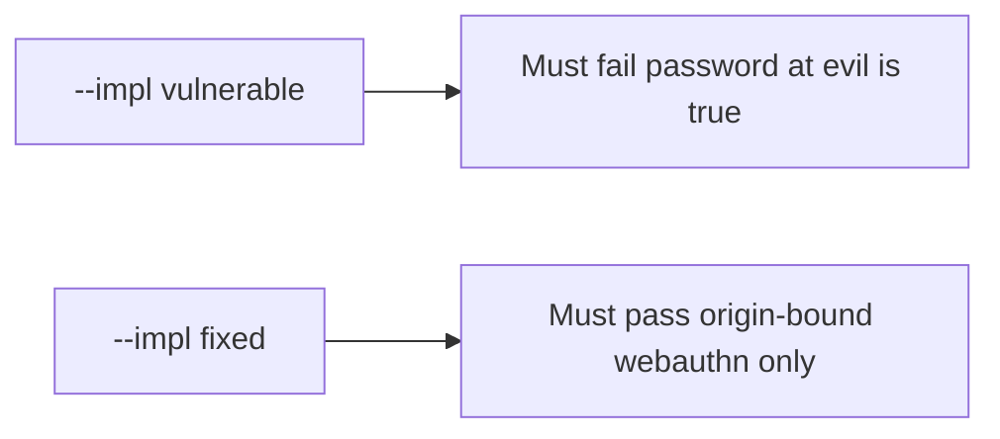

# 4.2-LO-05 — Evidence is password-at-evil false, then a passing pair

**Kind:** verification-lab
**Loop step:** 5 Verify
**Standards:** OWASP ASVS 5.0.0 (final) `v5.0.0-6.3.3`.

## An invariant that cannot fail a test is still a slogan

“We use passkeys” is not evidence. The oracle is the local pair.

## Mental model: vulnerable must fail: password at evil is true

The failing observation on `--impl vulnerable` is **password at evil is true**. A passing collection count is not this cell.



| Case | Must show |
|---|---|
| Negative / abuse | password and otp at evil origin are not resistant |
| Wrong origin | webauthn at evil origin fails |
| Matching origin | webauthn at the real origin may claim resistance |
| Not claimed | Live authenticators; 1.2 |

Lab tests in `labs/4.2/4.2-lab/tests/test_property.py`:

```
python3 -m pytest labs/4.2/4.2-lab/tests --impl vulnerable
python3 -m pytest labs/4.2/4.2-lab/tests --impl fixed
```

## What the tests do not prove

- Recovery SMS
- Prompt bombing
- Clinic SSO (transfer)

## Practice

Execute both implementations. Map each test to an LO-02 cell.

## Transfer

Clinic SSO. A test that only asserts HTTP 200 is not authenticator evidence (see 9.3).
