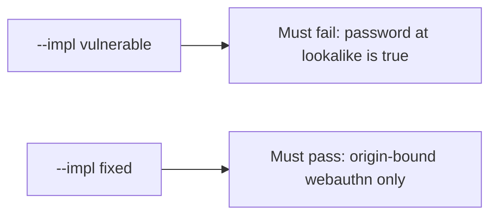

# The broken files must fail when a look-alike site gets the password

**Kind:** verification-lab
**Loop step:** 5 Verify

## Check it

“We use passkeys” is not evidence. “MFA is on” is a tool observation. The check is: `phishing_resistant("password", EVIL, REAL)` is false. That observation must be **false** on `--impl vulnerable` (the helper returns true) and **true** on `--impl fixed`.

## Picture: broken files must fail: password at lookalike is true

A passing-test tally can still hide that a password is still labeled resistant.



If both pass, you are not looking at password-at-lookalike.

## What the check has to show

| Mode | Must show |
|---|---|
| Normal | After the fix, webauthn at the real origin may claim resistance |
| Wrong input / abuse | password and otp at the lookalike origin are not resistant; broken files must fail |
| Wrong origin | webauthn at the lookalike origin fails |
| Not claimed | Live authenticators; who-is-allowed; recovery SMS; prompt bombing |

`test_password_is_not_phishing_resistant` is there so a password counted as phishing-resistant still fails.

```text
python3 -m pytest labs/4.2/4.2-lab/tests --impl vulnerable
python3 -m pytest labs/4.2/4.2-lab/tests --impl fixed
```

Map each check to a rule from the map page. If the broken files do not fail the password-at-lookalike assertion, the practice is miswired — fix the wiring, not the check. A setup error is not proof the rule holds. WebAuthn Level 3 is still a Candidate Recommendation; this pair does not turn it into a finished Rec.

| Slice | This practice |
|---|---|
| Required rule | password at lookalike → not resistant |
| Why it happens | shared secret treated as resistant; origin ignored |
| Trigger | `phishing_resistant("password", EVIL, REAL)` |
| How you stop it | webauthn **and** origin == expected |
| Not claimed | Live authenticators; who-is-allowed for notes; recovery SMS |

## What the checks do not prove

- Recovery SMS
- Prompt bombing
- Clinic SSO (that is the transfer page)
- That WebAuthn decides who may read a note
- A later hardware bar as a silent baseline

## Practice

Do not treat a grep for `webauthn` in HTML as the check. Call `phishing_resistant` on the password / lookalike pair.

## Use it somewhere new

Clinic SSO. Asserting HTTP 200 is not authenticator evidence. Do not run a check that loads a live identity provider.

## What this page is not doing

Do not add a live phishing page. Do not log passwords. Answer keys are not on this site.
