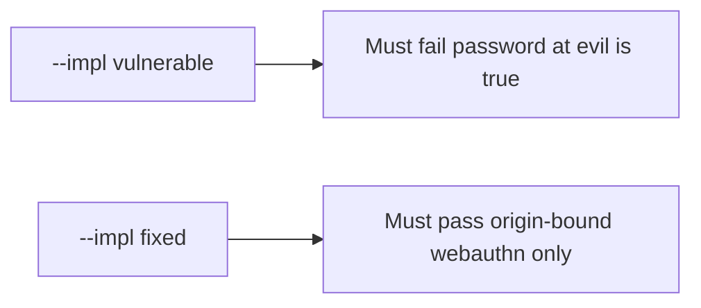

# 4.2-LO-05 — Evidence is password-at-evil false, then a passing pair

**Kind:** verification-lab
**Loop step:** 5 Verify
**Standards:** OWASP ASVS 5.0.0 (final) `v5.0.0-6.3.3`. WebAuthn L3 remains a **Candidate Recommendation**.

## An invariant that cannot fail a test is still a slogan

“We use passkeys” is not evidence. “MFA is on” is a mechanism observation. The oracle is: `phishing_resistant("password", EVIL, REAL)` is false. That observation must be **false** on `--impl vulnerable` (the helper returns true) and **true** on `--impl fixed`.

## Mental model: vulnerable must fail: password at evil is true

The failing observation on `--impl vulnerable` is **password at evil is true**. A passing collection count is not this cell.



| Mode | Must show for this module |
|---|---|
| Normal | After the fix, webauthn at the real origin may claim resistance |
| Negative / abuse | password and otp at evil origin are not resistant; vulnerable must fail |
| Wrong origin | webauthn at evil origin fails |
| Not claimed | Live authenticators; 1.2; recovery SMS; prompt bombing |

Lab tests in `labs/4.2/4.2-lab/tests/test_property.py`. `test_password_is_not_phishing_resistant` is a **forbidden-outcome** test: a password counted as phishing-resistant is not allowed to count as a passing control.

```text
python3 -m pytest labs/4.2/4.2-lab/tests --impl vulnerable
python3 -m pytest labs/4.2/4.2-lab/tests --impl fixed
```

Map each test to an LO-02 cell. If vulnerable does not fail the password-at-evil assertion, the lab is miswired—fix the wiring, not the assertion.

## What the tests do not prove

- Recovery SMS
- Prompt bombing
- Clinic SSO (transfer)
- That WebAuthn authorizes notes (1.2 / 4.4)
- Level 3 hardware clause as a silent baseline

Record those as residuals or later modules, not as silent passes.

## Practice

Execute both implementations this session. Write the fail/pass pair next to the matrix row. Reject a “test” that only greps `webauthn` in HTML without calling `phishing_resistant` on the password/evil pair.

## Transfer

Clinic SSO. A test that only asserts HTTP 200 is not authenticator evidence (see 9.3). A test that loads a live IdP is out of scope.

## Non-goals

Do not add a live phishing page. Do not log passwords. Keys stay out of this file.
