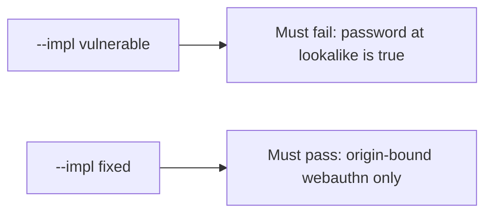

# Fail on the broken files, then pass on the repaired ones

**Kind:** verification-lab
**Loop step:** 5 Verify

## If you cannot test it, it is still a slogan

“We use passkeys” is not evidence. “MFA is on” is a tool observation. The check is: `phishing_resistant("password", EVIL, REAL)` is false. That observation must be **false** on `--impl vulnerable` (the helper returns true) and **true** on `--impl fixed`.

## Picture: broken files must fail: password at lookalike is true

A check that only counts passing cases can pass while a password is still labeled resistant. This check asks whether a password counted as phishing-resistant still counts as a passing control. Broken must fail that question. Repaired must pass it.



If both pass, the check is not looking at password-at-lookalike. If both fail, the fix is not structural or the check is wrong.

## Four modes, even for a boolean

| Mode | Must show |
|---|---|
| Normal | After the fix, webauthn at the real origin may claim resistance |
| Wrong input / abuse | password and otp at the lookalike origin are not resistant; broken files must fail |
| Wrong origin | webauthn at the lookalike origin fails |
| Not claimed | Live authenticators; who-is-allowed; recovery SMS; prompt bombing |

The file is `labs/4.2/4.2-lab/tests/test_property.py`. `test_password_is_not_phishing_resistant` is a **what-must-not-happen** check: a password counted as phishing-resistant is not allowed to count as a passing control.

```text
python3 -m pytest labs/4.2/4.2-lab/tests --impl vulnerable
python3 -m pytest labs/4.2/4.2-lab/tests --impl fixed
```

Map each check to a cell from the map page. If the broken files do not fail the password-at-lookalike assertion, the practice is miswired — fix the wiring, not the check. An environment error is not security evidence. WebAuthn Level 3 is still a Candidate Recommendation; this pair does not turn it into a finished Rec.

| Slice | This practice |
|---|---|
| Required rule | password at lookalike → not resistant |
| Why it happens | shared secret treated as resistant; origin ignored |
| Trigger | `phishing_resistant("password", EVIL, REAL)` |
| How you stop it | webauthn **and** origin == expected |
| Not claimed | Live authenticators; who-is-allowed for notes; recovery SMS |

## What the checks do not prove

- Recovery SMS
- Prompt bombing
- Clinic SSO (that is the transfer page)
- That WebAuthn decides who may read a note
- A later hardware bar as a silent baseline

Record those as leftover risk or later topics, not as silent passes.

## Practice

Run both implementations this session. Write the fail/pass pair next to the matrix row. Reject a “test” that only greps `webauthn` in HTML without calling `phishing_resistant` on the password / lookalike pair.

## Use it somewhere new

Clinic SSO. A check that only asserts HTTP 200 is not authenticator evidence. A check that loads a live identity provider is out of scope.

## What this page is not doing

Do not add a live phishing page. Do not log passwords. Answer keys stay out of this file.
