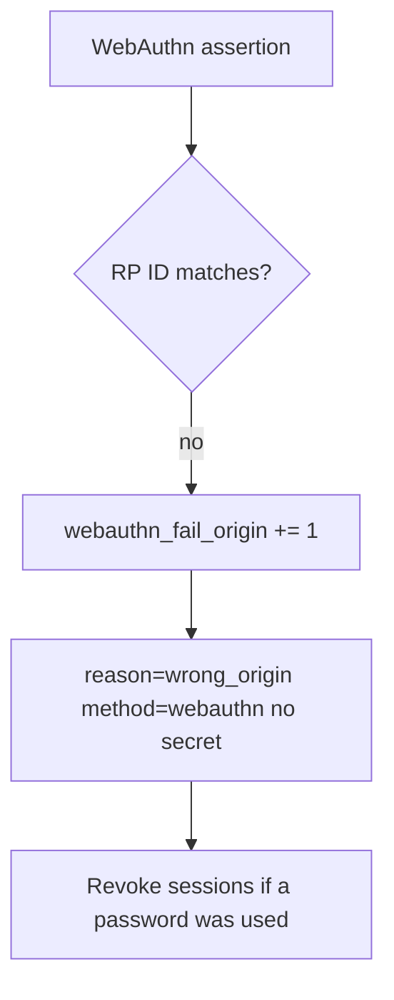

# Notice wrong-origin WebAuthn; revoke without logging secrets

**Kind:** operations-exercise
**Loop step:** 6 Operate

## Fixing it once is not enough

A recovery SMS, a shared password, or a stolen authenticator can still mint a session. Do not write passwords, OTP, note bodies, or staff passwords into the ticket.

## Picture: origin mismatch, then revoke



A log product does not bind RP ID.

## Signals that do not become a second leak

| Outcome | This topic |
|---|---|
| Notice | `webauthn_fail_origin`; `recovery_used` (higher risk) |
| What the line holds | method, origin class, request id — **never** the password |
| Recover | Revoke sessions; force a re-bind |
| Leftover | Password-only users; honest labeled leftover |

Turning MFA on does not make a password phishing-resistant. A password at a lookalike still has to fail `test_password_is_not_phishing_resistant`. Origin-mismatch WebAuthn and password-at-lookalike are two observations of the same claim: do not close one without retesting the other.

“2FA enrolled” on the identity-provider tile can hide a login banner that still says “phishing-resistant password.” Notice must look at the **helper boolean**, not the vendor tile. A password on the helper-boolean metric is a second leak.

| Slice | This practice |
|---|---|
| Notice | `webauthn_fail_origin` |
| Signal | method, origin class, `request_id`; never the password |
| Recover | Revoke sessions if a password was used; force a re-bind |
| Leftover | Password-only users; recovery SMS |

## Practice

```text
log_denied reason=not_phishing_resistant method=password origin_class=mismatch request_id=req_42pr
```

A password, OTP, note body, or “MFA handled” in that log is a leak before anyone pages.

## Use it somewhere new

Notice lookalike SSO; do not paste the staff password into the ticket. Do not visit a live lookalike.

## A usable leftover

Do not encode “phishing-resistant” as green-only. Keyboard users still need a working WebAuthn path or they will share passwords.

## What this page is not doing

Do not use live phishing hunts. Answer keys are not on this site.
