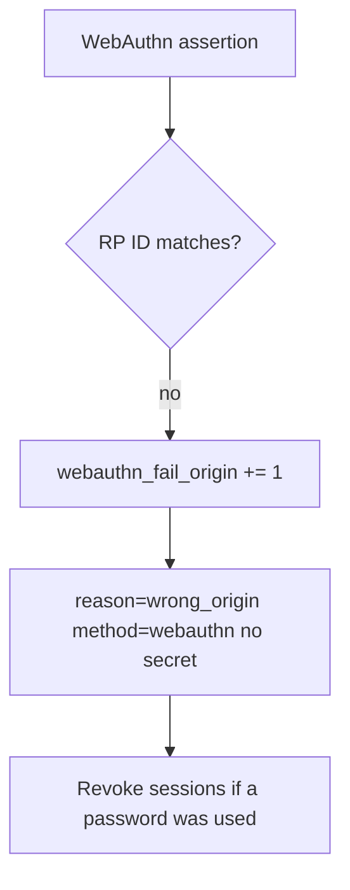

# Notice wrong-origin WebAuthn; revoke without logging secrets

**Kind:** operations-exercise
**Loop step:** 6 Operate

## Stopping it is not enough

A recovery SMS, a shared password, or a stolen authenticator can still mint a session after the helper was “fixed once.” Pair notice and recover. Do not log passwords, OTP, or note bodies. Do not paste a staff password into the ticket.

## Picture: origin mismatch, then revoke



Noticing, responding, and recovering still need an owner. They do not bind RP ID. They do not pick a log product.

## Signals that do not become a second leak

| Outcome | This topic |
|---|---|
| Notice | `webauthn_fail_origin`; `recovery_used` (higher risk) |
| What the line holds | method, origin class, request id — **never** the password |
| Recover | Revoke sessions; force a re-bind |
| Leftover | Password-only users; honest labeled leftover |

A vendor name is not this week's rule. A green “MFA enabled” tile is not that check. Re-run `test_password_is_not_phishing_resistant` after any login-copy change. Origin-mismatch WebAuthn and password-at-lookalike are two observations of the same claim: do not close one without retesting the other.

An identity-provider dashboard will show “2FA enrolled” and stay silent when the login banner still says “phishing-resistant password.” Notice must look at the **helper boolean**, not the vendor tile. If the alert includes a password, you have opened a second leak.

| Slice | This practice |
|---|---|
| Notice | `webauthn_fail_origin` |
| Signal | method, origin class, `request_id`; never the password |
| Recover | Revoke sessions if a password was used; force a re-bind |
| Leftover | Password-only users; recovery SMS |

## Practice

Write one log line you would accept in review. Tie it to `labs/4.2/4.2-lab`. Example shape (fake ids only):

```text
log_denied reason=not_phishing_resistant method=password origin_class=mismatch request_id=req_42pr
```

Reject any line that includes a password, OTP, note body, or “MFA handled.”

## Use it somewhere new

A clinic example: notice lookalike SSO; do not paste the staff password into the ticket. Do not visit a live lookalike.

## A usable leftover

Do not encode “phishing-resistant” as green-only. Keyboard users still need a working WebAuthn path or they will share passwords.

## What this page is not doing

A vendor name is not this week's rule. Live phishing hunts are out of scope. Answer keys are not on this site.
