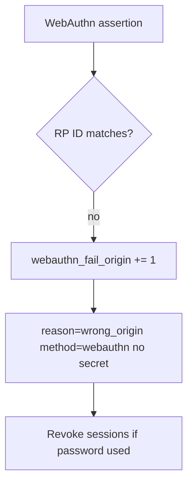

# 4.2-LO-06 — Detect wrong-origin WebAuthn; revoke without logging secrets

**Kind:** operations-exercise
**Loop step:** 6 Operate
**Standards:** NIST CSF 2.0 (final) DE/RS/RC as outcome labels; OWASP ASVS 5.0.0 (final) `v5.0.0-6.3.3`.

## Prevention is not absolute

A recovery SMS, a shared password, or a compromised authenticator can still mint a session. Pair detect and recover. Do not log passwords or note bodies (3.1).

## Mental model: origin mismatch then revoke



| Outcome | This module |
|---|---|
| Detect | `webauthn_fail_origin`; `recovery_used` (higher risk) |
| Signal | method, origin class, request id; never the password |
| Recover | Revoke sessions (4.1); force re-bind |
| Residual | Password-only users; honest labeled residual |

## Practice

Write one log line you would accept. Tie it to `labs/4.2/4.2-lab`.

```
log_denied reason=not_phishing_resistant method=password origin_class=mismatch request_id=req_42pr
```

Reject any line that includes a password, OTP, or note body.

## Transfer

Clinic: detect lookalike SSO; do not paste the staff password into the ticket.

## Non-goals

SIEM product names are not the property.
