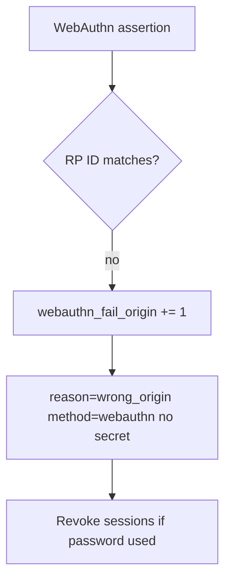

# 4.2-LO-06 — Detect wrong-origin WebAuthn; revoke without logging secrets

**Kind:** operations-exercise
**Loop step:** 6 Operate
**Standards:** NIST CSF 2.0 (final) DE/RS/RC as outcome labels; OWASP ASVS 5.0.0 (final) `v5.0.0-6.3.3`. CSF names outcomes; it does not bind RP ID.

## Prevention is not absolute

A recovery SMS, a shared password, or a compromised authenticator can still mint a session after the classifier was “fixed once.” Pair detect and recover. Do not log passwords, OTP, or note bodies (3.1). Do not paste a staff password into the ticket.

## Mental model: origin mismatch then revoke



| Outcome | This module |
|---|---|
| Detect | `webauthn_fail_origin`; `recovery_used` (higher risk) |
| Signal | method, origin class, request id; never the password |
| Recover | Revoke sessions (4.1); force re-bind |
| Residual | Password-only users; honest labeled residual |

CSF 2.0 Detect / Respond / Recover name outcomes. They do not prove `v5.0.0-6.3.3`. A SIEM product name is not the property. Re-run `test_password_is_not_phishing_resistant` after any login-copy change; a green “MFA enabled” tile is not that pytest. Origin-mismatch WebAuthn and password-at-evil are two observations of the same claim: do not close one without retesting the other.

## Framework defaults versus the operate guarantee

An IdP dashboard will show “2FA enrolled” and stay silent when the login banner still says “phishing-resistant password.” Detection must observe the **classifier boolean**, not the vendor tile. If the alert includes a password, you have opened a 3.1 cell.

## Practice

Write one log line you would accept. Tie it to `labs/4.2/4.2-lab`.

```text
log_denied reason=not_phishing_resistant method=password origin_class=mismatch request_id=req_42pr
```

Reject any line that includes a password, OTP, note body, or “MFA handled.”

## Transfer

Clinic: detect lookalike SSO; do not paste the staff password into the ticket. Do not visit a live lookalike.

## Usability

Do not encode “phishing-resistant” as green-only (WCAG 2.2 Success Criterion 1.4.1). Keyboard users still need a working WebAuthn path or they will share passwords.

## Non-goals

SIEM product names are not the property. Live phishing hunts are out of scope. Gates 0–10 stay not-attempted.
