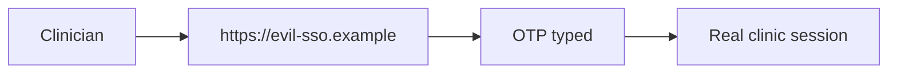

# Same idea on clinic SSO and step-up export

**Kind:** transfer-challenge
**Loop step:** 7 Transfer

## Use it somewhere new

You get a **clinic staff SSO** portal. Optionally: a second ceremony before chart export. A password or OTP typed at a lookalike identity provider is still a shared secret. WebAuthn that ignores origin is still theater.

On the notes app, `phishing_resistant("password", evil, real)` is false. The same rule has to hold on the clinic portal.

## Picture: MFA to the wrong identity provider is still phishing

Renaming `"password"` to `"otp"` is not transfer. A lookalike identity provider is still the wrong origin. Who-is-allowed still runs after login.

| Notes app this week | Clinic sketch |
|---|---|
| Browser user at the notes-app origin | Clinician at the staff SSO portal |
| Password or OTP at `https://evil.example` | Password or OTP at a lookalike identity provider |
| WebAuthn bound to RP ID | Step-up before export still origin-bound |
| Password leftover | Password leftover; recovery SMS |

Step-up before export must bind origin too, or the second factor is theater. FastAPI, Next.js, and an SSO vendor dashboard do not compare RP ID. A mouse-only “approve” on the real origin still leaves the password leftover if the accessible path is broken. Authenticator guidance still calls OTP phishable even when the real identity provider later accepts it.

## Prompt — clinic SSO and step-up export

Clinic staff SSO portal. Optionally: step-up for export — still origin-bound?

Product sketch: a small EHR login plus a second ceremony before chart export.

Write the same rule here. Include:

1. who can act (lookalike identity provider; intercepted OTP; tired clinician — **not** a live clinic or public phishing page);
2. what you trust (which origin check is trusted; “we use Okta” is not);
3. what must not happen (`phishing_resistant("otp", evil, real)` is true, or a step-up password counted as resistant);
4. a check idea on a **local** helper only (password / OTP / webauthn × origin matrix);
5. leftover (password leftover; recovery SMS; WebAuthn does not decide who may read a chart);
6. whether a human path must meet the web accessibility baseline (keyboard, labels, not color-only).

## What is not good enough

| Reject | Why |
|---|---|
| “Any 2FA is phishing-resistant” | OTP still walks to the lookalike page |
| Live clinic identity provider | Course rules |
| Passkey vendor as the rule | Tool, not the claim |
| HTTP 200 as authenticator evidence | Wrong observation |
| Unlabeled later hardware bar as baseline | That bar is later |

Naming Okta, “we use SSO,” or a step-up checkbox on the real portal is not the helper. `phishing_resistant("otp", evil, real)` is false, and a password typed at the lookalike identity provider is still a shared secret. The local analogue is still `test_password_is_not_phishing_resistant` plus a wrong-origin WebAuthn deny — run against a helper, not a live clinic identity provider. Recovery SMS and a mouse-only ceremony remain leftovers; they do not make OTP phishing-resistant.

## Practice

One page. No keys. `labs/4.2/4.2-lab` is the only running system you may break. Do not visit a lookalike identity provider or export from a live EHR.

## What this page is not doing

Live phishing campaigns. Real staff credentials. Claiming a mastery gate from this page.
