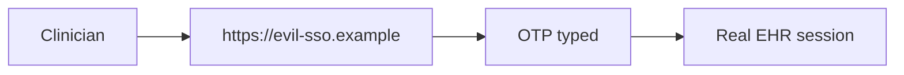

# 4.2-LO-07 — Transfer: clinic SSO and step-up export

**Kind:** transfer-challenge
**Loop step:** 7 Transfer
**Standards:** NIST SP 800-63B-4 (final); WebAuthn Level 3 (**Candidate Recommendation**); WCAG 2.2 (final).

## Change the portal; keep origin binding

Do not answer with a Top 10 / CWE / scanner as the definition of security. The SecureCollab sentence was: `phishing_resistant("password", evil, real)` is false. Rewrite it for a clinic portal without changing the fork.

**Prompt:** Clinic staff SSO portal. Optionally: step-up for export — still origin-bound?

**Product sketch:** EHR-lite login plus a second ceremony before chart export.

Rewrite the SecureCollab sentence. Include:

1. attacker capabilities (lookalike IdP; intercepted OTP; fatigued clinician — **not** a live clinic or public phishing page);
2. trust assumptions (which origin check is TCB; “we use Okta” is not);
3. forbidden outcome (`phishing_resistant("otp", evil, real)` is true, or step-up password counted as resistant);
4. a test idea on a **local** fixture only (password/OTP/webauthn × origin matrix);
5. residual (password fallback; recovery SMS; WebAuthn ≠ authorization);
6. WCAG 2.2 on the ceremony (keyboard, labels, not color-only).

## Mental model: MFA to the wrong IdP is still phishing

Step-up for export must bind origin too, or the second factor is theater. FastAPI, Next.js, and an SSO vendor dashboard do not compare RP ID. A mouse-only “approve” on the real origin still leaves the password residual if the accessible path is broken. 800-63B-4 still calls OTP a phishable authenticator even when the real IdP later accepts it.

The clinic rewrite still has to keep the SecureCollab fork: `phishing_resistant("otp", evil, real)` is false, and a password typed at the lookalike IdP is still a shared secret. Naming Okta, “we use SSO,” or a step-up checkbox on the real portal is not that oracle. The local pytest analogue is still `test_password_is_not_phishing_resistant` plus a wrong-origin WebAuthn deny — run against a fixture, not a live clinic IdP. Recovery SMS and a mouse-only ceremony remain residuals; they do not make OTP phishing-resistant.

## What graders reject

| Reject | Why |
|---|---|
| “Any 2FA is phishing-resistant” | OTP walks |
| Live clinic IdP | Lab policy |
| Passkey vendor as the property | Mechanism |
| HTTP 200 as authenticator evidence | Wrong observation |
| Unlabeled Level 3 hardware as baseline | Advanced clause |

## Practice

One page. No keys. `labs/4.2/4.2-lab` is the only running system you may break. Do not visit a lookalike IdP or export from a live EHR.

## Non-goals

Live phishing campaigns. Real staff credentials. Claiming Gate 4 from this page.
