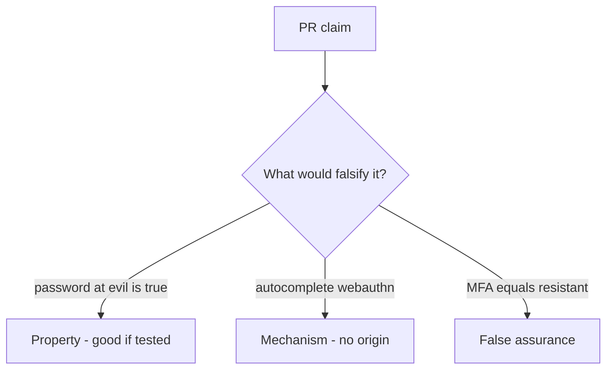

# 4.2-LO-08 — Review the resistant-password claim as a PR, not a banner

**Kind:** code-review
**Loop step:** Review
**Standards:** OWASP ASVS 5.0.0 (final) `v5.0.0-6.3.3`; WebAuthn Level 3 (**Candidate Recommendation**).

## Review the fixture as if it were SecureCollab login copy

Review `labs/4.2/4.2-lab/vulnerable/` as a SecureCollab PR. Your job is not to count suspicious lines. Reconstruct whether `phishing_resistant("password", EVIL, REAL)` is still true, compare that with the module invariant, and write changes a developer can verify.

Intended findings live only in `content/assessment/keys/4.2.md` — not here. Do not open the keys file until your review has been evaluated.

## Mental model: phishing_resistant('password', evil, real) True

Start with this seeded smell: **`phishing_resistant('password', evil, real)` True**. Label it property, mechanism, or false assurance before you accept the PR.

Classification starts at the protected effect (password at evil is false). Everything that is not origin binding at that call is a candidate ambient path.

## Seeded smells (label them yourself)

- `phishing_resistant('password', evil, real)` True
- Marketing copy “MFA = phishing resistant”
- Recovery SMS as default
- No wrong-origin WebAuthn test

Also reject: client trust; closing findings without re-running `test_password_is_not_phishing_resistant`; keys in lessons; real credentials in fixtures; unlabeled Level 3 hardware as baseline; live kit language.

## Misconceptions this module refuses

- Any 2FA is phishing-resistant
- WebAuthn replaces authorization
- Usable login is a nice-to-have
- A passkey vendor name is the property
- Training users to read the URL is the TCB

## Practice

Write three review notes a maintainer could act on. Each note: observation, property or false assurance, suggested structural change, residual you will **not** delete. Tie at least one to `test_password_is_not_phishing_resistant`.

## Transfer

Clinic SSO PR that “adds MFA” without an origin-fail test is an incomplete mediation review. Name the independent falsehood that would still keep password-at-evil false.

## Non-goals

Do not merge by adding a comment “will add WebAuthn later.” That comment is a residual without an owner. Do not visit a live lookalike to prove the finding.
