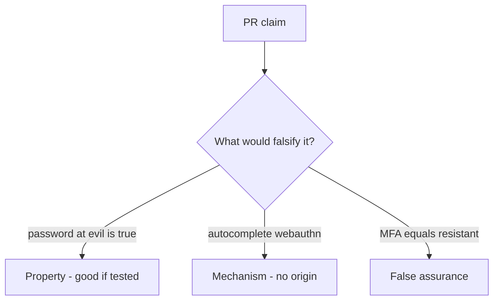

# 4.2-LO-08 — Review the resistant-password claim as a PR, not a banner

**Kind:** code-review
**Loop step:** Review
**Standards:** OWASP ASVS 5.0.0 (final) `v5.0.0-6.3.3`; WebAuthn Level 3 (**CR**).

## Review the fixture as if it were SecureCollab login copy

Review `labs/4.2/4.2-lab/vulnerable/` as a SecureCollab PR. Intended findings live only in `content/assessment/keys/4.2.md` — not here.

## Mental model: property, mechanism, or false assurance

Seeded smells (label them yourself; do not open the keys file):

- `phishing_resistant('password', evil, real)` True
- Marketing copy “MFA = phishing resistant”
- Recovery SMS as default
- No wrong-origin WebAuthn test

Also reject: client trust, closing findings without retest, keys in lessons, real credentials in fixtures, unlabeled Level 3 hardware as baseline.

## Misconceptions

- Any 2FA is phishing-resistant
- WebAuthn replaces authorization
- Usable login is a nice-to-have

## Practice

Write three review notes. Tie at least one to `test_password_is_not_phishing_resistant`.

## Transfer

Clinic SSO PR that “adds MFA” without an origin-fail test is incomplete.
