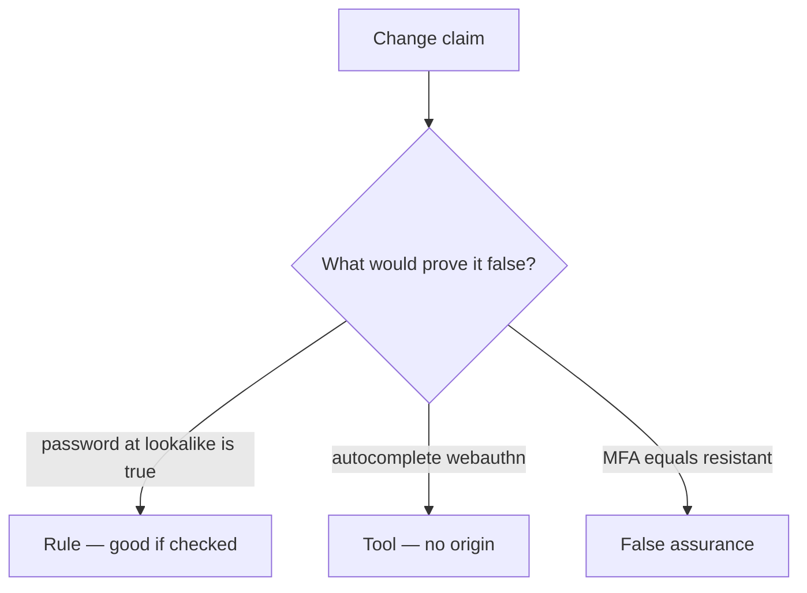

# Review of a “resistant password” claim

**Kind:** code-review
**Loop step:** Review

## What you are reviewing

Review `labs/4.2/4.2-lab/vulnerable/` as a change to notes-app login copy. Reconstruct whether `phishing_resistant("password", EVIL, REAL)` is still true.

A banner that says “phishing-resistant password” does not make `test_password_is_not_phishing_resistant` pass.

## Picture: problems to find (name them yourself)

**`phishing_resistant('password', evil, real)` True**.

For each claim and each branch, label **rule**, **tool**, or **false assurance**. A password at a lookalike still has to be false. If the change never checks origin binding, the leftover is still there.

Problems to find (name them yourself; do not open the keys file):

- `phishing_resistant('password', evil, real)` True
- Marketing copy “MFA = phishing resistant”
- Recovery SMS as default
- No wrong-origin WebAuthn check

Also reject: trusting the client; closing findings without re-running `test_password_is_not_phishing_resistant`; keys in learner notes; real credentials in helpers; an unlabeled later hardware bar as baseline; live-kit language.

## Common mix-ups

- Any 2FA is phishing-resistant
- WebAuthn replaces who-is-allowed
- A usable login is a nice-to-have
- A passkey vendor name is the rule
- Training users to read the URL is what you trust

## Use it somewhere new

Clinic SSO change that “adds MFA” without an origin-fail check is an incomplete review. What would still keep a password at a lookalike site from counting as resistant?

## What this page is not doing

Until `test_password_is_not_phishing_resistant` passes, “will add WebAuthn later” is unfinished work. Do not visit a live lookalike to prove the finding.
