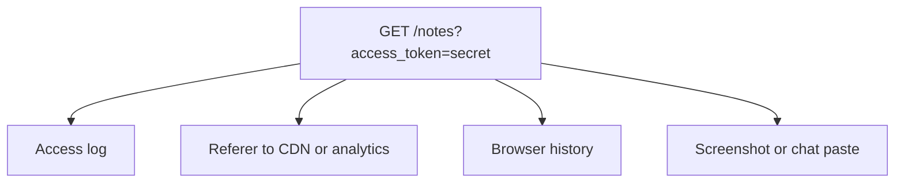
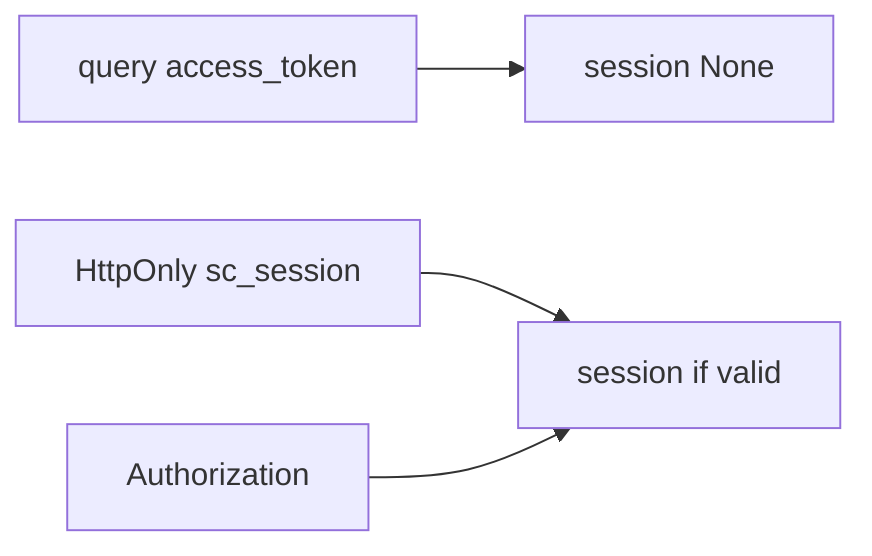

# A token in the URL is not a session

**Kind:** concept-model
**Loop step:** 1 Property

## The rule

The notes app already carries a session from the last lesson. That session must not appear in the URL. Query strings land in access logs, in the Referer header sent to other sites, in screenshots, and in browser history. TLS encrypts the hop. It does not stop those copies. A cookie marked HttpOnly, or an `Authorization` header, is an acceptable channel. `?access_token=` is not.

> `session_from_request({"access_token": "secret"}, {}, None)` must return `None`. A session may come from the cookie `sc_session` or from an Authorization header. Uvicorn access logs will store query strings. A JWT sitting in localStorage is a different leak: scripts can read it.

What must not happen is a **session started from a query-string token**. The session secret is no longer secret. Anyone who can see the URL can then act as that person.

Industry lists ask for secrets in the body or headers, not in the URL. They want a referrer policy so path and query do not leak to other sites. They want HttpOnly for session cookies that scripts cannot read. Putting an OAuth token in the URL the old implicit-grant way is obsolete. Copying that pattern is not those checklists.

## Picture: the URL is a postcard



The person who can hurt you here is a log operator, a Referer collector, or someone with a shared screenshot — not a brand-new JWT bug.

**A tool is not the rule.** “We use JWTs,” NextAuth, or a blog titled SPA best practice 2016.

## Picture: three channels, one deny



The cookie lesson already separated cookie-jar sending from script readability. This page adds: the jar (or the header) is acceptable; the query string is not.

## Why it happens, what it costs, how you stop it, how you notice, how you recover

| Slice | For this rule |
|---|---|
| Why it happens | Token placed in a logged, shared channel |
| What has to be true first | `session_from_request` prefers query |
| Trigger | Link clicked, logged, or referred |
| What it costs | The session secret is no longer secret |
| How you stop it | Ignore query tokens; cookie or Authorization only |
| How you notice | `query_token_rejected`; a log-redact gateway |
| How you recover | Revoke the leaked token; purge logs |

## What the framework does vs what you still have to check

FastAPI will bind query params. Next.js router will put them in the address bar. TLS encrypts the hop, not the log. The app’s promise: a query-only request yields `None`; cookie and header still work. The folder is `labs/4.3/4.3-lab`. No live CDNs.

## What the tool cannot do

- A magic-link email is still a URL token — short-lived, one-use, not a standing session.
- Referer on first-party navigations — strip it on the way out.
- Header tokens leaking through a CORS misconfig (later).

## Practice

Name the channel and the deny rule. Then run:

```text
python3 -m pytest labs/4.3/4.3-lab/tests --impl vulnerable
python3 -m pytest labs/4.3/4.3-lab/tests --impl fixed
```

The first command must fail. The second must pass. Tie the check to query `access_token`, not to a JWT library name.

## Use it somewhere new

Clinic appointment deep link. Magic-link email (still a URL token — later you exchange it).

## What this page is not doing

Live token replay, real session cookies, weaponized Referer harvesting. This page does not finish a check-in. Answer keys are not on this site.
