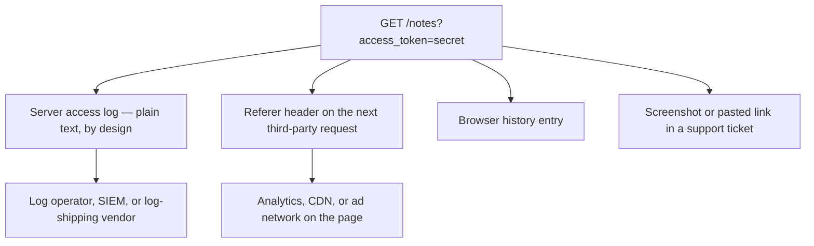
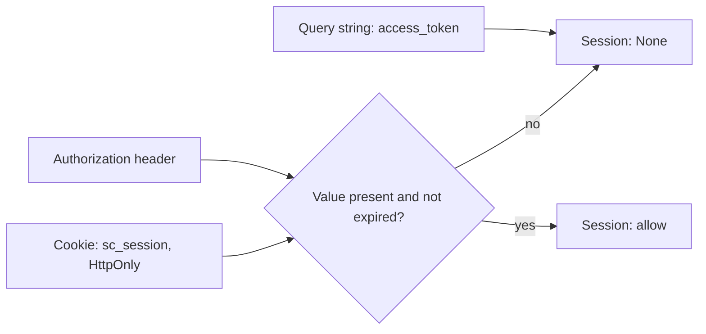

# A token in the URL is not a session

**Kind:** concept-model
**Loop step:** 1 Property
**Standards:** OWASP ASVS 5.0.0 `v5.0.0-14.2.1` (sensitive data, including session tokens, only in HTTP bodies or headers, never in a URL or query string) and `v5.0.0-3.4.5` (a referrer policy so technically sensitive data does not leak to third parties via `Referer`).

## The rule

The notes app on SecureCollab already carries a session from the authentication lesson: a login mints a value, the browser holds it, and every later request has to present it. State the property before naming any mechanism. For a request on this week's build, a session cannot start or continue from a value carried in the query string. It may start or continue from the cookie `sc_session`, marked `HttpOnly`, or from an `Authorization` header. If the only place a candidate token appears is `?access_token=…`, the answer is no, and that answer does not change if the token is long, random, signed, or delivered over TLS.

That last clause is the part worth slowing down on, because it is the part a competent engineer gets wrong first. TLS encrypts the bytes between the browser and the server for the duration of one connection. It says nothing about what either endpoint does with those bytes once they arrive, and a URL is read by far more than the one connection that carried it. A web server's access-log middleware runs after TLS has already been terminated, so it logs the full request line — path and query string together — as plain text, on purpose, because that is what an access log is for. A browser that follows a link from `https://app.securecollab.test/notes?access_token=secret` to any third-party resource on that page — an analytics pixel, a font, an embedded image — sends the full originating URL, query string included, as the value of the `Referer` header on that new, unrelated request, to a server the session was never meant to trust. The same URL sits in the browser's history the moment the page loads, and in any screenshot or copy-paste of the address bar a person makes while getting help or filing a bug. None of those four copies required an attacker to break anything; each one is a feature working as designed, reading a value the application chose to put where all of them could see it. Ban the query-string channel and the bytes cannot reach any of the four; deny the query channel and hope TLS covers the rest, and it does not, because none of the four sits on the wire TLS protects.

> `session_from_request({"access_token": "secret"}, {}, None)` must return `None`. The same call with the token in `cookie={"sc_session": "secret"}` or in the `Authorization` argument must return `"secret"`. Uvicorn's access log will still print the full query string of any request whose URL carries one, whether the parser accepts the value or not — the check has to happen before the value is treated as a session, not instead of the log line being written.

## Picture: one token, four unrelated readers



Every arrow out of `Url` fires on an ordinary page load; none of them requires a vulnerability. The diagram is not a list of four bad things that could happen — it is one value, fanning out to four readers, each of which was already trusted with something narrower (an access log needs a path, not a secret; an ad network needs nothing from this session at all) and is now handed the session outright because the value sat in the one place every one of them already reads.

## Picture: three arrival channels, one decision



Cookie and header both feed the same downstream check — validity is decided later, by mechanisms this module gets to in the Build and Verify lessons. The query string never reaches that check at all; it is refused before validity is even asked about, because presence in that channel is disqualifying on its own, independent of whether the value inside it happens to be correct.

## Vocabulary this module needs

A **session** is server-recognized state that lets a sequence of otherwise-stateless HTTP requests be treated as one continuing interaction with one authenticated party; what identifies the session to the server is the **session identifier** (or session token — the two terms are used interchangeably in this course for a bearer value that stands in for "this request belongs to session X"). `HttpOnly` is a cookie attribute a server sets in its response; a browser that honors it will still send the cookie on every request to the issuing origin but will refuse to expose its value to JavaScript running on the page, which is a distinct guarantee from "not in the URL" — a value can be `HttpOnly` and still end up in a query string if some other code path puts it there, and a value can be entirely absent from cookies and yet leak just as badly by living in `localStorage`, which no `HttpOnly` flag touches at all. The browser-security-model module covers what `HttpOnly` does and does not defend against in full; this lesson is about which *channel* carries the token, a question that is prior to and separate from what protects the token once it has chosen a channel.

## What a competent engineer believes here, and why it is wrong

Three answers come up often enough to name and refuse individually, rather than leaving them as an unranked list.

**"We serve everything over HTTPS, so the query string is protected."** This is the belief the worked example above exists to refute directly: TLS protects the segment of the journey between browser and server, and every one of the four leak paths — access log, `Referer`, history, screenshot — happens on one side of that segment or the other, never on the wire itself. A team that has verified its TLS configuration has verified a real and necessary control; they have verified a control that answers a different question than the one this lesson asks.

**"It's a JWT, so it's fine wherever it goes."** JSON Web Token is a *format* — a way of packing claims and a signature into a compact string — not a statement about which channel is safe to carry that string on. A JWT in a query string is exactly as visible to an access log as an opaque random token in a query string; signing the contents proves the issuer meant to say what it said, and says nothing at all about who else now holds a readable copy of the string. Treat format and channel as two separate design decisions, because a reviewer who accepts "it's signed" as an answer to "where does it travel" has been shown one property and asked to certify a different one.

**"We'll add a `Referrer-Policy` header, so that closes it."** A strict referrer policy is a real, useful, and cheap control — it is also one lock on one of the four doors in the diagram above. It stops the URL from traveling outward in a `Referer` header to a third party. It does nothing about the server's own access log, which never goes anywhere near the browser's referrer behavior; it does nothing about browser history; it does nothing about a screenshot. Naming the mechanism that closes one path and treating the property as solved is the same mistake in miniature that [Lesson 04 Build](04-build.md) makes explicit for cookie attributes: one control answering one narrower question is not the same claim as the property holding.

## What the framework does vs. what you still have to check

FastAPI will happily bind `access_token` as a query parameter if a route declares one, because binding a parameter is exactly what a query-parameter declaration is for — the framework has no opinion about whether that parameter should be allowed to authenticate anyone. Next.js's client-side router will put whatever is in the URL into the visible address bar without complaint, because that is what an address bar does. Uvicorn's default access-log format includes the full request line, query string and all, because that is the useful default for debugging ordinary traffic. None of these defaults is a bug in the framework; all three exist for good reasons that have nothing to do with session security, and all three mean the "the framework will protect me" assumption fails here specifically because the framework was never asked the security question.

## Practice

Run this only inside `labs/4.3/4.3-lab/`. The data is synthetic; `secret` is a fixture label, not a real credential.

```text
python3 -m pytest labs/4.3/4.3-lab/tests --impl vulnerable
python3 -m pytest labs/4.3/4.3-lab/tests --impl fixed
```

Before running either command, predict which of the three arrival channels each of the three existing tests exercises, and which one the vulnerable fixture gets wrong. Then run the commands and check your prediction against the actual failure.

## Use it somewhere new

A clinic appointment reminder that links to `https://clinic.securecollab.test/visit?token=abc123` carries the exact same shape of value in the exact same channel, whatever the parameter is named. [Lesson 07 Transfer](07-transfer.md) works through that case and a magic-link email in full; predict, before you get there, which of this lesson's four leak paths apply unchanged to an SMS link instead of a page load, and which one (screenshots of a phone's messaging app) is arguably worse.

## What this page is not doing

This page does not harvest a `Referer` header from a live site, dump a production access log, or replay a real session cookie. The fake token `secret` in the worked example never leaves `labs/4.3/4.3-lab`. Answer keys are not on this site.
