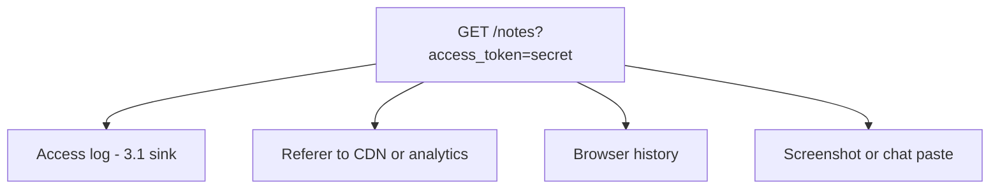
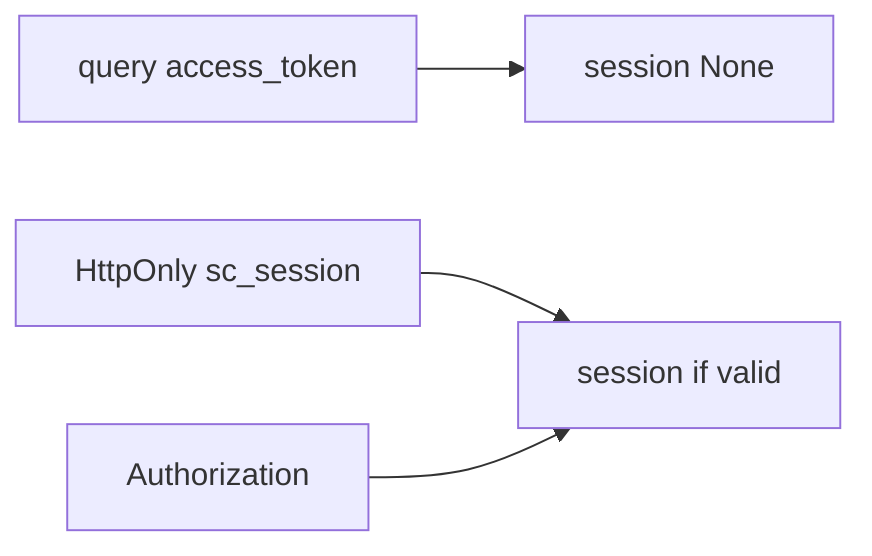

# 4.3-LO-01 — A query-string token is not a session

**Kind:** concept-model
**Loop step:** 1 Property
**Standards:** OWASP ASVS 5.0.0 (final) `v5.0.0-14.2.1` (no sensitive data in URL/query), `v5.0.0-3.4.5` (Referrer-Policy), `v5.0.0-3.3.4` (HttpOnly session cookies; 2.3). JWT is a token *format*, not an architecture.

## The claim this module owns

SecureCollab Phase 1 carries a session after 4.2. That artifact must not appear in the URL. Query strings land in access logs, Referer to third parties, screenshots, and browser history. TLS does not stop those copies. Cookie (HttpOnly, 2.3) or `Authorization` is the channel; `?access_token=` is not.

> `session_from_request({"access_token": "secret"}, {}, None)` must return `None`. A session may come from cookie `sc_session` or an Authorization header. Uvicorn access logs will store query strings (3.1 / 4.3). A JWT in localStorage is a different leak (2.3 script-readable).

The forbidden outcome is **session established from a query-string token**. That is a 1.1 confidentiality failure of the session secret, then 1.2 as whoever holds the URL.

ASVS `v5.0.0-14.2.1` wants secrets in body or headers, not the URL. `v5.0.0-3.4.5` wants a referrer policy so path and query do not leak. `v5.0.0-3.3.4` wants HttpOnly for script-inaccessible session cookies. OAuth implicit-in-URL is obsolete; copying it is not ASVS.

## Mental model: the URL is a postcard



The attacker is a log operator, a Referer collector, or a shared screenshot — not a novel JWT CVE.

**Mechanism (not the property):** “we use JWTs,” NextAuth, or a blog titled SPA best practice 2016.

## Mental model: three channels, one deny



2.3 already separated cookie-jar sending from script readability. This module adds: the jar (or header) is acceptable; the query string is not.

## Root cause vs impact vs prevention vs detection vs recovery

| Slice | For this property |
|---|---|
| Root cause | Token placed in a logged, shared channel |
| Preconditions | `session_from_request` prefers query |
| Trigger | Link clicked, logged, or referred |
| Impact | Confidentiality of the session artifact |
| Prevention | Ignore query tokens; Cookie or Authorization only |
| Detection | `query_token_rejected`; log-redact gateway |
| Recovery | Revoke the leaked token; purge logs (3.1) |

## Framework defaults versus the channel guarantee

FastAPI will bind query params. Next.js router will put them in the address bar. TLS encrypts the hop, not the log. The lab guarantee: query-only requests yield `None`; cookie/header still work. Oracle: `labs/4.3/4.3-lab`. No live CDNs.

## Mechanism limits

- Magic-link email is still a URL token — time-bound, one-use (6.6), not a standing session.
- Referer on first-party navigations — strip on outbound.
- Header tokens in CORS misconfig (E2).

## Practice

Name the channel and the deny rule. Then run:

```
python3 -m pytest labs/4.3/4.3-lab/tests --impl vulnerable
python3 -m pytest labs/4.3/4.3-lab/tests --impl fixed
```

The first command must fail. The second must pass. Map the assertion to query `access_token`, not to a JWT library name.

## Transfer

Clinic appointment deep link. Magic-link email (6.6).

## Non-goals

Live token replay, real session cookies, weaponized Referer harvesting. Gates 0–10 and milestones M0–M5 stay **not-attempted** without learner or product evidence. Answer keys are not in this file.
