# An old identifier does not become trustworthy by logging in

**Kind:** design-exercise
**Loop step:** 2 Model

## The rule

Lesson 01 fixed which channels a session value may arrive on. This lesson asks a question that channel choice does not answer at all: given a value that arrived on an acceptable channel, when was that value actually created, and by whom? For SecureCollab's notes app, an identifier that exists *before* a successful login must not be the identifier that carries authority *after* it. Authentication has to mint a fresh identifier and retire whatever the browser was holding before, or the login event has not actually changed anything about what that browser can do — it has only changed whether a server-side check happens to say yes.

That distinction matters because of an attack that does not need to break anything cryptographic. Suppose SecureCollab issues a session cookie to every visitor, authenticated or not, so that a shopping-cart-style feature works before login. An attacker who can get a victim's browser to hold a *known* value in that cookie — by sending a link that sets it, by exploiting a subdomain that can write cookies for the parent domain, or simply by reading it from an unauthenticated response the attacker triggered on a shared kiosk — has planted a session identifier the attacker also knows. If the victim then logs in and the server keeps using that same cookie value to represent the now-authenticated session, the attacker's copy of the value is now a valid session for the victim's account, and the attacker never needed to see a password, intercept a token, or find a bug in the login form. This is **session fixation**, and naming it is less important than seeing why it survives a cryptographically strong identifier: a 256-bit random value that the attacker planted and that survives login unchanged is exactly as fixed as a predictable one, because unguessability was never the property under attack. The property under attack is whether *this specific value* became authoritative through an authentication event the server actually witnessed, or through some other route entirely.

> A pre-authentication identifier `sess_pre_9f2` exists in the browser before login. After a successful login, the server must issue a *different* identifier — call it `sess_auth_7c1` — and `sess_pre_9f2` must no longer be accepted for anything, including the request that just carried it. If the server instead keeps honoring `sess_pre_9f2` after login and merely attaches the authenticated user to it, an attacker who planted `sess_pre_9f2` before the victim logged in now holds a live authenticated session.

## Picture: the state machine a login event has to drive

```mermaid
stateDiagram-v2
  [*] --> Anonymous: browser's first request
  Anonymous --> Anonymous: request with no valid identifier
  Anonymous --> Authenticated: successful login mints a NEW identifier; old one retired
  Authenticated --> Authenticated: request with a valid, unexpired, unrevoked identifier
  Authenticated --> IdleExpired: no request for longer than the idle window
  Authenticated --> AbsoluteExpired: total age exceeds the absolute lifetime
  Authenticated --> Revoked: logout, or an administrator/detection action
  IdleExpired --> [*]: must re-authenticate
  AbsoluteExpired --> [*]: must re-authenticate
  Revoked --> [*]: must re-authenticate
```



This diagram is the evidence this module's objective hierarchy calls a session protocol/state diagram, and it is worth reading state by state rather than as decoration. The transition out of `Anonymous` is not labeled "login succeeds" alone — it specifically says a *new* identifier is minted and the old one is retired, because that clause is the entire content of C2, and a diagram that drew the arrow without it would be drawing the fixation bug as though it were the fix. Three separate paths lead out of `Authenticated` and all three land back at the same place: idle expiry, absolute expiry, and revocation are three different reasons a session stops being good, and [Lesson 03 Break](03-break.md) and [Lesson 06 Operate](06-operate.md) each own one distinct failure mode of that fan-out.

## Step 1: name who touches a session value, and what each one can do

| Actor | Can read the value? | Can cause a request that carries it? | Can force the server to accept it as authenticated? |
|---|---|---|---|
| The legitimate browser | Yes, from its own cookie jar or memory | Yes, on every request to the origin | No — only the server's own login logic decides this |
| A log operator or SIEM | Only if it appears in query strings or logs (Lesson 01) | No | No |
| An attacker who planted a pre-auth value | Yes, because the attacker chose it | Yes, by getting the victim's browser to send it, or by sending it themselves | Yes, *if* the server treats the planted value as authoritative once the victim logs in — this is exactly the failure C2 forbids |
| The server's authentication logic | Reads the presented value; decides whether to mint a new one | N/A | Yes — this is the only row where "yes" is supposed to appear |

The fourth row is the point of the table: the only actor who is supposed to be able to make a session identifier authoritative is the server's own authentication logic, at the moment it verifies credentials, and the third row exists specifically to show that this exclusivity is not automatic — it has to be built, because a server that reuses whatever identifier a request happened to arrive with has quietly granted that same power to anyone who can plant a value in row three.

## Step 2: write the rows a lab could fail

| Precondition | Action | Required outcome |
|---|---|---|
| Browser holds no session value | Successful login | A new identifier is minted; it did not exist before this request |
| Browser holds a pre-authentication identifier `X` | Successful login | The active session after login uses an identifier other than `X`; `X` is no longer accepted |
| Browser holds identifier `Y`, already authenticated | Successful re-authentication (e.g., step-up, password change) | A new identifier replaces `Y`; `Y` is retired, matching ASVS `v5.0.0-7.2.4` |
| Attacker presents `X` (the retired pre-authentication value) after the victim's login | Any request | Server rejects `X`; it must not resolve to the victim's authenticated session |

The last row is the one an implementation can satisfy by accident and lose by refactoring. Picture a login handler written this way:

```text
def login(request, credentials):
    if not verify(credentials):
        return reject()
    session = session_store.get(request.session_id) or session_store.create()
    session.authenticated_user = credentials.username
    return session
```

This reads as though it mints a session on login, and for a browser with no prior cookie at all, it does. For a browser that already holds a pre-authentication `request.session_id`, though, `session_store.get(...)` finds the existing record and the function attaches authentication to *that same object* rather than creating a new one — the "mint a new identifier" step the diagram promises never actually runs, because the code took the `or session_store.create()` branch only when no record existed yet, not "always, on a successful login." An attacker who planted `request.session_id` before the victim logged in now owns a live, authenticated session, and every line of this function still looks like it is doing its job. A correct fix does not add a second valid identifier alongside the first; it makes the pre-authentication identifier *stop* being valid — a deletion or explicit invalidation, issued unconditionally on every successful login, not merely a lookup that happens to create a fresh record only when it finds nothing.

## Why this is not this module's lab, and why that is stated rather than hidden

The authentication module (phishing resistance and usable access) owns the authentication event itself — the code path that checks a password or a WebAuthn assertion and decides "yes, mint." This module's Tier-1 fixture, `session_from_request`, is a pure function over a single already-arrived request; it has no login event inside it for an identifier to be bound *to*, and adding a login step would turn a channel-parsing predicate into a different, stateful system belonging to a different lesson's lab. Naming this honestly — "this claim is modeled here and tested in 4.2's lab, not fabricated a test for here" — is the discipline `spec.md`'s coverage contract exists to enforce: a claim with no evidence anywhere is not taught, but a claim whose evidence correctly lives in a sibling module's lab is not the same failure as a claim nobody ever built evidence for at all.

## What a competent engineer believes here, and why it is wrong

**"We use a cryptographically random session ID, so fixation isn't possible."** Randomness defends against *guessing* a valid identifier. Fixation does not guess anything — the attacker already knows the value, because the attacker (or a shared, unauthenticated code path) is the one who caused it to exist in the victim's browser in the first place. A 256-bit identifier that survives login unchanged is planted exactly as easily as a four-digit one; entropy answers "can an outsider find this by searching," not "did this identifier change hands through an authentication event."

**"Login just sets a flag on the existing session; that's simpler than minting a new one."** It is simpler, and it is the specific simplification C2 forbids, because "simpler" here means "the browser's session identifier before login and after login are the same string," which is precisely the condition an attacker who planted that string needs to be true.

## Practice

Draw the four-row table from Step 2 for SecureCollab's actual login route (name the exact request and response fields you would inspect), then predict which row the authentication module's lab already tests and which row belongs to this module.

## Use it somewhere new

A clinic's appointment-booking flow that lets a visitor start filling in details before creating an account has exactly the same pre-authentication-identifier shape. [Lesson 07 Transfer](07-transfer.md) asks which identifier a returning, now-authenticated visitor is using, and whether it is the one the anonymous flow handed out.

## What this page is not doing

This page does not implement or test a live login route; the state machine and the tables are a design model, not a claim that a login endpoint exists in this module's lab. Answer keys are not on this site.
