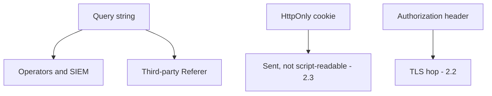
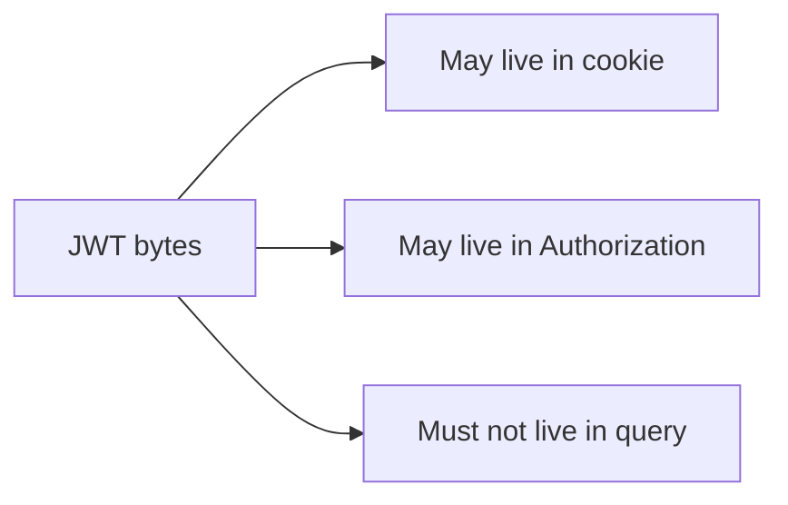

# 4.3-LO-02 — Channels a second engineer can test

**Kind:** design-exercise
**Loop step:** 2 Model
**Standards:** OWASP ASVS 5.0.0 (final) `v5.0.0-14.2.1` and `v5.0.0-3.4.5`.

## Can a second engineer name pytest cases from your channel map?

“We use HttpOnly” is not this lesson. A reviewable map names **query / cookie / header**, **who sees each**, and **deny on query**.

SecureCollab Phase 1 freeze: local `session_from_request(query, cookie, header)`. Synthetic token `secret`. No live CDN.

## Mental model: who can read the channel

## Mental model: JWT is a format

Signing algorithm is 5.2. Channel is this module.

## Step 1: freeze pieces

| Piece | This system |
|---|---|
| Subjects | Browser; logger; CDN referrer |
| Objects | `access_token` query; `sc_session` cookie; Authorization |
| Actions | `session_from_request` |
| Channels | query, cookie, header, logs |
| TCB | Parser that ignores query tokens |
| Untrusted | URL, Referer, reverse-proxy logs |
| State / time | Link forwarded months later |
| 1.1 cell | Confidentiality of the session artifact |

## Step 2: write cells

| Subject | Object | Action | Decision |
|---|---|---|---|
| browser | query token | authn | deny |
| browser | HttpOnly cookie | authn | allow-if-valid |
| browser | Authorization | authn | allow-if-valid |
| logger | url | store | no-token |

## Practice

Draw this map so a second engineer could name pytest cases. Point at `labs/4.3/4.3-lab` file `token.py`.

## Transfer

Magic-link email (6.6). Clinic appointment deep link.

## Residual risk

First-party Referer; screenshot of a cookie is out of scope here.

## Non-goals

Top 10 as the definition of security. Keys stay out of lessons.
