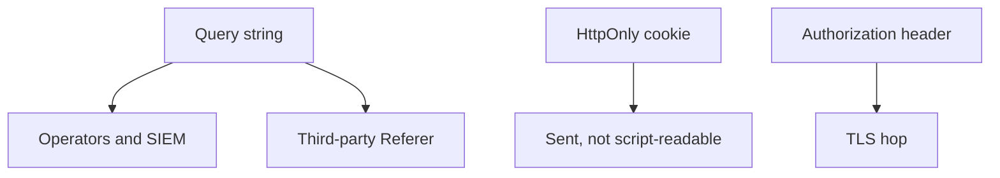
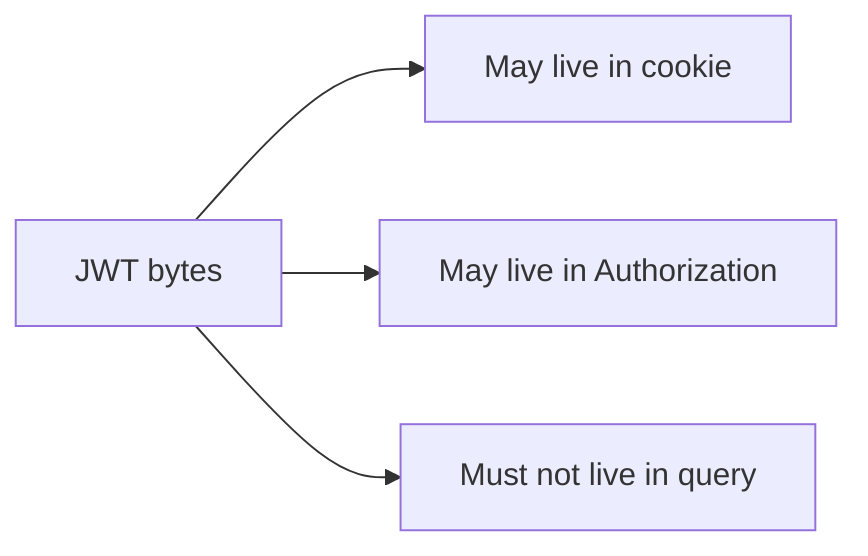

# Channels someone else can test

**Kind:** design-exercise
**Loop step:** 2 Model

## Could someone else name the checks from your channel map?

“We use HttpOnly” is not this page. A reviewable map names **query / cookie / header**, **who sees each**, and **deny on query**.

`session_from_request(query, cookie, header)` is local. Fake token `secret`. No live CDN.

## Picture: who can read the channel

## Picture: JWT is a format

How you sign the token is a later lesson. Which channel carries it is this page.

## Step 1: name who, what, and when

| Piece | This system |
|---|---|
| Who | Browser; logger; CDN referrer |
| What | `access_token` query; `sc_session` cookie; Authorization |
| Actions | `session_from_request` |
| Channels | query, cookie, header, logs |
| What you trust | Parser that ignores query tokens |
| What you do not trust | URL, Referer, reverse-proxy logs |
| State / time | Link forwarded months later |
| The rule | The session secret stays secret |

## Step 2: write rows the lab can fail

| Who | What | Action | Decision |
|---|---|---|---|
| browser | query token | authn | deny |
| browser | HttpOnly cookie | authn | allow-if-valid |
| browser | Authorization | authn | allow-if-valid |
| logger | url | store | no-token |

## Practice

In `labs/4.3/4.3-lab`, mark `token.py`.

## Use it somewhere new

Magic-link email (later: one-time redeem). Clinic appointment deep link.

## What can still go wrong

First-party Referer; a screenshot of a cookie is out of scope here.

## What this page is not doing

Do not treat a famous-bugs list as the definition of security. Answer keys are not on this site.
