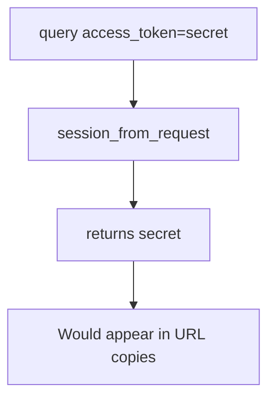

# Practice: a session started from a query-string token

**Kind:** mechanism-lab
**Loop step:** 3 Break

## Try it

The practice is not a website you attack. It is a tiny in-process `session_from_request`. Fake token `secret`. It does not open uvicorn, a CDN, or a browser history. A query-string session is a **failed rule**, not a trophy dump of a log.

The rule under test:

> `session_from_request({"access_token": "secret"}, {}, None)` must return `None`. A session must not start from a query-string token.

## Where you may practice

Only `labs/4.3/4.3-lab` is in scope. Restore the broken and repaired folders when you are done. Fake token `secret` only.

Do not harvest Referer from a live site, dump production access logs, or replay a real session cookie.

What must not happen: a session started from a query-string token. `session_from_request({"access_token": "secret"}, {}, None)` returns `"secret"`.

Who could do this: a **log operator**, a Referer collector, or someone with a shared screenshot who can read the URL. What is supposed to stop this: the parser ignores query tokens. FastAPI query binding, the Next.js address bar, and “we use JWTs” are not enough.

TLS encrypts the hop. It does not encrypt the access log.

## Picture: query wins



The broken files show **cause** (token in a logged, shared channel), not a trophy dump of production logs. What has to be true first: `session_from_request` prefers `query.get("access_token")`. You do not need a live GET. You must not fetch a URL that contains a real token.

Industry lists ask for secrets in the body or headers, not in the URL. HTTPS is a hop tool, not that sentence.

## What to look at: the cause, not a trophy

Read `vulnerable/token.py`. It returns `query.get("access_token")` first. Checks:

- `test_query_string_token_is_rejected` — query-only yields `None`
- `test_cookie_session_still_works` — `sc_session` still works on the repaired files
- `test_authorization_header_still_works`

You do not need a new token string. The failure of `test_query_string_token_is_rejected` *is* the evidence.

Do not open the repaired files yet. Diagnose the cause first.

## Why it happens, what it costs, how you stop it, how you notice, how you recover

| Slice | This practice |
|---|---|
| The rule | Query `access_token` does not mint a session |
| Why it happens | Token placed in a logged, shared channel |
| What has to be true first | `session_from_request` prefers query |
| Trigger | `session_from_request({"access_token": "secret"}, {}, None)` |
| What it costs | The session secret is no longer secret; then whoever holds the URL can act as that person |
| How you stop it | Ignore query tokens; cookie or Authorization only |
| How you notice | `query_token_rejected`; a log-redact gateway |
| How you recover | Revoke the leaked token; purge logs |
| Not the lesson | A JWT algorithm name, NextAuth, or “HTTPS so logs are fine” |

## What the framework does vs what you still have to check

FastAPI will bind query params. Next.js router will put them in the address bar. TLS encrypts the hop, not the log. What this practice is supposed to show: query-only → `None`.

## Practice

```text
python3 -m pytest labs/4.3/4.3-lab/tests --impl vulnerable
```

Record `test_query_string_token_is_rejected`. Do not weaken it to “we use HTTPS.” A setup error is not proof the rule holds.

## Use it somewhere new

Clinic deep link with `?token=`. Predict without leaving this directory. Do not click a live appointment SMS.

## What this page is not doing

No live-target Referer harvesting. Fake `secret` only.
