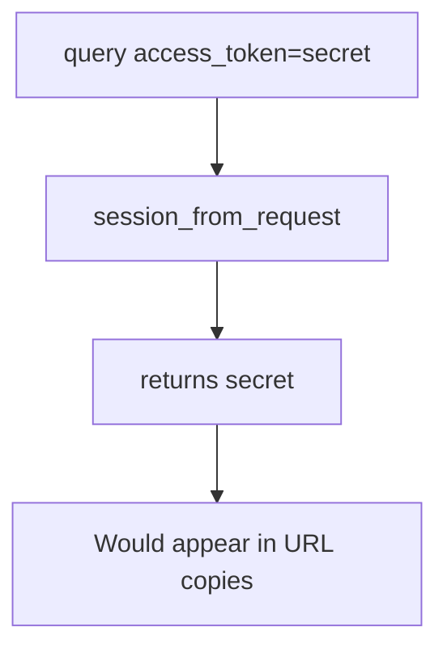

# 4.3-LO-03 — Observe the query token accepted, do not trophy a log

**Kind:** mechanism-lab
**Loop step:** 3 Break
**Standards:** OWASP ASVS 5.0.0 (final) `v5.0.0-14.2.1`.

## Authorized scope

`labs/4.3/4.3-lab` only. Synthetic token `secret`. No live access logs.

**Forbidden outcome:** Session established from a query-string token.

## Mental model: query wins



The vulnerable tree demonstrates **cause** (token in a logged channel), not a trophy dump of production logs.

## What to read in the fixture

`vulnerable/token.py` returns `query.get("access_token")` first. Tests require that path to yield `None`, while cookie and Authorization still work on the fixed tree.

## Root cause vs impact

| Slice | Lab |
|---|---|
| Root cause | Token placed in a logged, shared channel |
| Impact | Session secret in logs, Referer, history |
| Not the lesson | A JWT algorithm name |

## Practice

```
python3 -m pytest labs/4.3/4.3-lab/tests --impl vulnerable
```

Record `test_query_string_token_is_rejected`. Do not weaken it to “we use HTTPS.”

## Transfer

Clinic deep link with `?token=`. Predict without leaving this directory.

## Non-goals

No live-target instructions. Synthetic data only.
