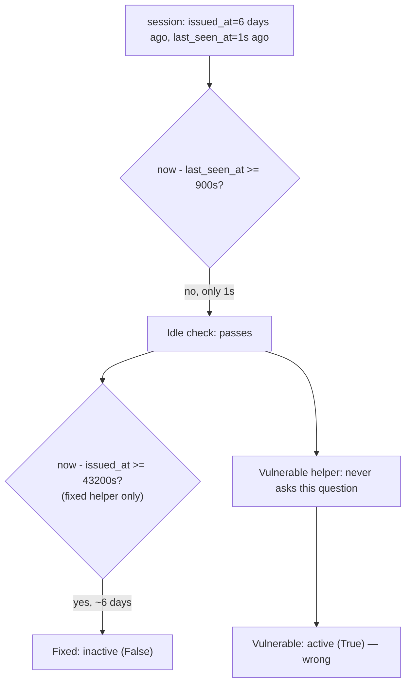

# Practice: a query token, and a session that never really ends

**Kind:** mechanism-lab
**Loop step:** 3 Break

## Try it

Run this only inside `labs/4.3/4.3-lab/`. The data is synthetic; `secret` and every timestamp below are fixture values, not real credentials or real clock readings.

The practice is not a website you attack. `labs/4.3/4.3-lab` ships two functions in `vulnerable/token.py` and `fixed/token.py`: `session_from_request`, which Lesson 01 already introduced, and `session_is_active`, which this lesson introduces. Neither opens uvicorn, a CDN, or a browser. Both are pure functions you call directly with dictionaries and numbers standing in for a request and a clock reading; the failure each one stages is visible from the return value alone, with no server, no log dump, and no live token required.

> `session_from_request({"access_token": "secret"}, {}, None)` must return `None` on the fixed helper; it returns `"secret"` on the vulnerable one. That failure is Lesson 01's, already familiar. `session_is_active(session, now)` is new: given a session record's `issued_at` and `last_seen_at` timestamps and a `now` reading, it decides whether the session is still good under a policy of 900 seconds of allowed idle time and 43,200 seconds (12 hours) of allowed total lifetime, no matter how recently it was touched.

## The second break: activity is not the same evidence as age

Read `vulnerable/token.py`'s `session_is_active` before running anything, because the bug is not obvious from the test names alone. The vulnerable version checks one thing: has this session been touched inside the last 900 seconds? If yes, it reports the session active. It never asks how long ago the session was originally minted. This looks reasonable — an idle timeout is a real, useful control, and the vulnerable code implements one correctly — and that is exactly why the gap survives a casual read: the code is not *wrong* about idle timeout, it is *silent* about absolute timeout, and a reviewer scanning for "does it check the last-seen time" finds a correct-looking yes and stops looking.

Here is the failure that silence produces. A session was minted five days ago — `issued_at` five days in the past, far beyond any reasonable 12-hour policy — but something has been touching it every ten minutes since: a legitimate user who never closed their laptop lid, or, just as easily, an attacker replaying a token stolen days ago and keeping it warm on purpose specifically because they have learned that activity resets the clock that matters. On the vulnerable helper, `session_is_active` returns `True`, because the only clock it consults is "seconds since last touch," and ten minutes ago passes that check regardless of what happened five days ago. On the fixed helper, the same call returns `False`, because a second, independent clock — "seconds since this was minted" — has to pass as well, and five days is nowhere near twelve hours.

> A session minted `43_200 * 10` seconds ago (roughly six days) but with `last_seen_at` one second before `now` is the forbidden outcome: `session_is_active` must return `False`. `test_forbidden_outcome_activity_alone_does_not_extend_the_absolute_limit` asserts exactly this, and the vulnerable helper fails it — not with an exception, but by confidently returning the wrong boolean, which is the more dangerous of the two ways a security check can fail.

This is the shape this module's third teaching claim names directly: an idle-only policy answers "has someone touched this recently," and a system that stops there has quietly promised an answer to "how long has this actually existed" that it never checked. The two questions feel like one question until you write down a case — a long-lived, frequently-touched session — where they disagree.

## Picture: which clock the vulnerable helper forgot



The diagram's branch is the whole lesson: both helpers agree on the idle question, and only one of them goes on to ask the absolute question at all. `Skip` is not a different answer to the same question — it is the question never being asked, which is a different and quieter failure than answering it wrong.

## Checks in this practice

`labs/4.3/4.3-lab/tests/test_property.py` carries nine checks across the two functions:

- `test_query_string_token_is_rejected`, `test_cookie_session_still_works`, `test_authorization_header_still_works` — Lesson 01's channel checks, unchanged by this lesson's work.
- `test_active_session_within_both_windows_is_active` — the normal case: a session minted an hour ago and touched a minute ago must be active on both helpers.
- `test_forbidden_outcome_activity_alone_does_not_extend_the_absolute_limit` — the break above; fails on `vulnerable`, passes on `fixed`.
- `test_idle_timeout_boundary_exact_deadline_is_expired` — a session touched exactly 900 seconds ago is already expired, not "on the last good second"; one second earlier, it is still active. Boundary tests exist because "at or past the deadline" and "strictly past the deadline" are one off-by-one apart, and a lab that never checks the boundary would let either choice through unnoticed.
- `test_missing_timestamp_fails_closed_not_open` — a session record missing `issued_at` or `last_seen_at` entirely must be treated as inactive, not as freshly minted. A plausible-looking fix that reads a missing timestamp with `session.get("issued_at", now)` — "default to right now if we don't know" — looks harmless and is fail-open: it turns "we have no idea how old this is" into "this is definitely brand new," which is the most generous answer available to exactly the case that deserves the least trust.
- Two anti-fake checks that construct their own session records, with `issued_at`/`last_seen_at` values never written anywhere else in this file, and assert the same disagreement the forbidden-outcome test asserts. A fix that happened to special-case the exact numbers used in the forbidden-outcome test — hard-coding a check against that one `issued_at` value rather than doing the arithmetic — would pass that test and fail these.

## Why it happens, what it costs, how you stop it, how you notice, how you recover

| Slice | Query-string break (C1) | Idle-only break (C3) |
|---|---|---|
| Why it happens | Token placed in a logged, shared channel | An idle clock is a real, correct control that gets mistaken for a complete lifetime policy |
| What's already wrong | `session_from_request` prefers query | `session_is_active` never reads `issued_at` |
| Trigger | `access_token` present in the query dict | A session repeatedly touched within its idle window, no matter its total age |
| What it costs | The session secret is no longer secret | A one-time theft becomes permanent, as long as the token is touched often enough |
| How you stop it | Ignore query tokens; cookie or `Authorization` only | Enforce both idle *and* absolute limits; fail closed on a missing timestamp |
| How you notice | `query_token_rejected` | `session_expired reason=absolute`, distinct from `reason=idle` |
| How you recover | Revoke the leaked token; purge logs | Force re-authentication at the absolute boundary regardless of activity |

## Practice

```text
python3 -m pytest labs/4.3/4.3-lab/tests --impl vulnerable
python3 -m pytest labs/4.3/4.3-lab/tests --impl fixed
```

Before running the vulnerable command, predict how many of the nine tests fail and which ones. The channel tests and the absolute-lifetime forbidden-outcome test should be on your list; the boundary and fail-closed tests are worth predicting too, since the vulnerable helper's idle logic is not itself wrong, only incomplete.

## Use it somewhere new

A clinic's patient portal that keeps a session "alive" for as long as a nurse's station has a browser tab open, shift after shift, is the same six-day session with a more sympathetic story attached. [Lesson 07 Transfer](07-transfer.md) asks what changes and what does not when the actor touching the session is trusted staff rather than an attacker.

## What this page is not doing

No live GET against a real host, no production log dump, no real session cookie. The fake token `secret` and every timestamp here are fixture values that never leave `labs/4.3/4.3-lab`.
